```{r setup, include=FALSE}
knitr::opts_chunk$set(echo = TRUE, tidy = FALSE, cache = FALSE, warning = FALSE, 
               message = FALSE)
knitr::opts_knit$set(eval.after = 'fig.cap')
```

# Introduction

In this tutorial you will learn how to get started with version control using 
[git](https://git-scm.com/) and [GitHub](https://github.com/). The main goal 
here is to provide a step-by-step introduction to GitHub, with detailed 
screenshots, so that you become familiar with its main functionalities. 

## Who

This tutorial is intended for grad students and academics who use 
[`R`](https://cran.r-project.org/) but are unfamiliar with the _command line_ 
or _terminal_. I assume nothing about the computer science skills of the user, but do
assume basic knowledge of `R` and `RStudio`.

## What

The outline is provided in the floating table of contents. You will learn the essential 
concepts and terminology of version control, Git, GitHub and GitHub desktop. This 
tutorial follows a _learn-by-doing_ approach. 

## Why

Familiarity with GitHub has become an indispensible tool for anyone working 
with data. Sharing code, writing software for your statistical method, 
producing techincal reports and creating websites have become essential 
skills to have in the rapidly growing field of data science. 
Other answers can be found 
[here](https://www.quora.com/Should-I-learn-Git-when-I-just-start-programming), 
[here](http://stackoverflow.com/questions/2658/getting-started-with-version-control) 
and [here](http://stat545.com/git01_git-install.html#but-first-why).

## How

Each of the topics covered are separated by chapters that should be followed 
sequentially. Within each chapter, there are a series of steps that you need 
to complete. Each step starts with some instructions followed by a screenshot. 

## Pre-requisites

Chapters 1-3 have no pre-requisites in terms of software. Chapters 4-8 require a working 
installation of [`R`](https://cran.r-project.org/) and 
[`RStudio`](https://www.rstudio.com/products/rstudio/download/preview/).

## What this isn't

It is _not_ a comprehensive tutorial of all the intracacies of Git. I skip over 
many fine details, because the main goal of this tutorial is an introduction 
to essential concepts and terminology of version control, Git, and GitHub.

It covers a variety of topics that could each be its own book. There are a plethora of
online resources available for everything covered here but you can't Google something
if you don't know what you're looking for in the first place. 


## Related Work

There are several more advanced and comprehensive online resources available for 
learning git and github for data science oriented people including:

- [Stat 545 at UBC by Jenny Bryan](http://stat545.com/git00_index.html)
- [Advanced R by Hadley Wickham](http://r-pkgs.had.co.nz/git.html)

The main difference here is that we don't use the terminal (or command line) and
provide screenshots for every step. 

*************
*************
*************

# Chapter 1: Installing Git {.tabset .tabset-fade .tabset-pills}

*************

## Introduction

Git is to GitHub, what R is to RStudio. In other words Git is the software that 
does all the work behind the scenes, and GitHub a user interface that makes its 
easier to communicate with Git (and adds functionality as well). In this chapter 
we will download and install Git. 

_Note: the screenshots provided here are from a Windows operating system, however it will be similar on a Mac or Linux._

*************
*************
*************
*************
*************
*************
*************
*************
*************
*************
*************
*************
*************
*************
*************
*************
*************
*************


## Step 1


[Download Git](https://git-scm.com/downloads)

*************

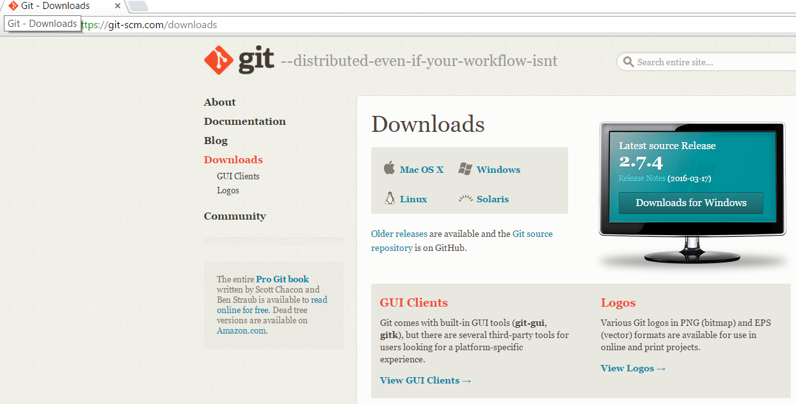

*************
*************
*************
*************
*************

## Step 2

Once the download has completed, click on the `Git-2.7.4 64-bit.exe` file 
(`.dmg` on a Mac, or `.deb` on Linux). _Note: the version you download might be different than what I've shown here, but that's ok_

*************


*************
*************
*************
*************
*************

## Step 3

Once you have read the GNU General Public License (this is not required 
to continue) click on `Next`. 

*************

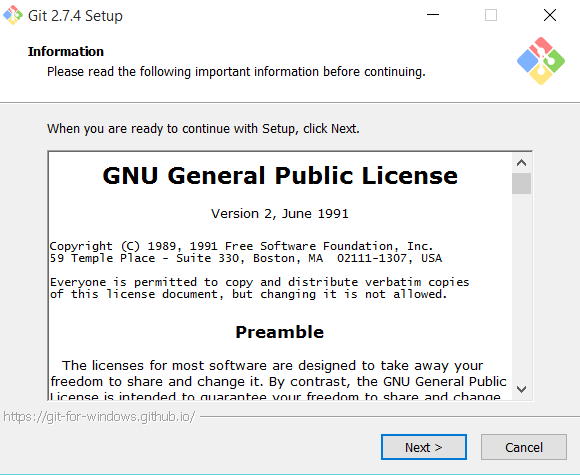

*************
*************
*************
*************
*************

## Step 4

You need to select where you want Git installed. I have chosen the default 
location `Program Files`, but you can change this if you like by clicking on 
the `Browse...` button. Once you have chosen a location click `Next`.

*************

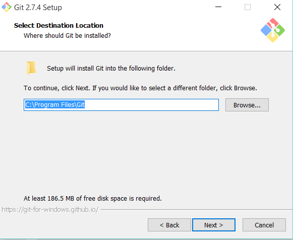

*************
*************
*************
*************
*************

## Step 5

Select the components you want to install. Ensure that at least the boxes 
shown in the screenshot below have been checked. Click `Next`.

*************


*************
*************
*************
*************
*************

## Step 6

This step is to select where you want the shortcut location to be stored. I 
have chosen the default. Then click `Next`. 

*************

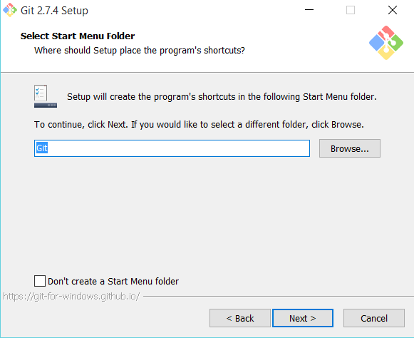

*************
*************
*************
*************
*************

## Step 7

Git can be used from the command line also. Selecting the second option allows 
you this flexibility for when you become familiar with Git. 
_Note: you might see different options on a Mac, if you don't know which option to choose, select the default_ 

*************

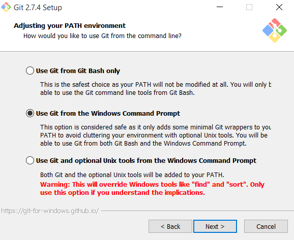

*************
*************
*************
*************
*************

## Step 8

Select the (recommended) first option and click `Next`. 
_Note: you might see different options on a Mac, if you don't know which option to choose, select the default_ 

*************

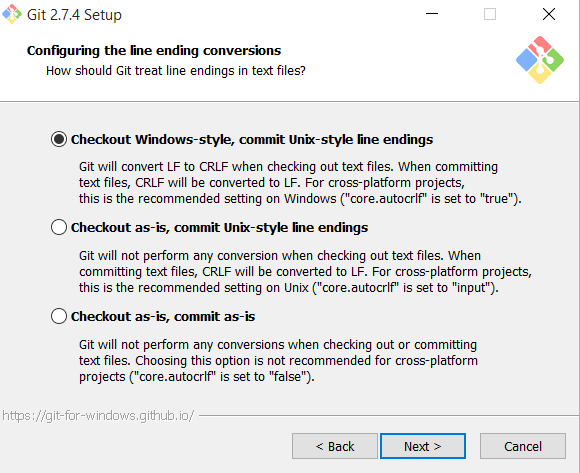

*************
*************
*************
*************
*************

## Step 9

Select the (recommended) first option and click `Next`. 
_Note: you might see different options on a Mac, if you don't know which option to choose, select the default_ 

*************

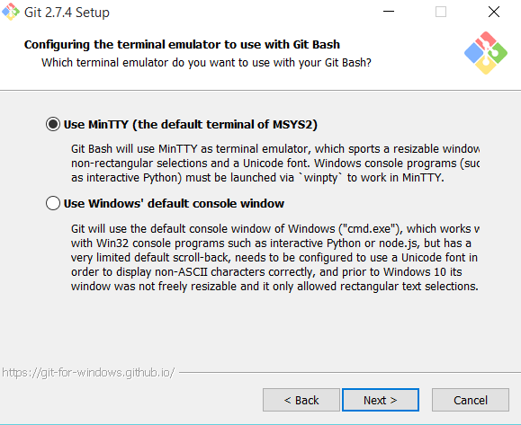

*************
*************
*************
*************
*************

## Step 10

Ensure that at least the `Enable Git Credential Manager` box is checked, and click `Next`.

*************


*************
*************
*************
*************
*************

## Step 11

You should see now see the following installation screen. 

*************

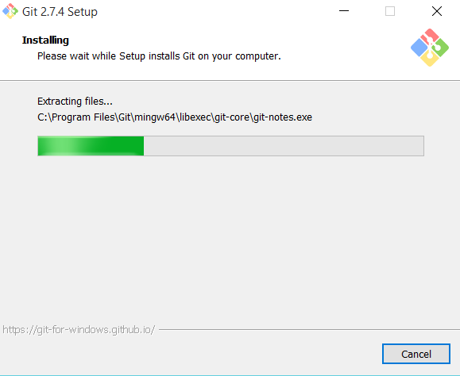

*************
*************
*************
*************
*************

## Step 12

The following screen will appear once the Git setup has successfully completed. 
Click on `Finish`. Well done, you have installed Git on your system. Proceed 
to Chapter 2 to signup for a GitHub account. 

*************

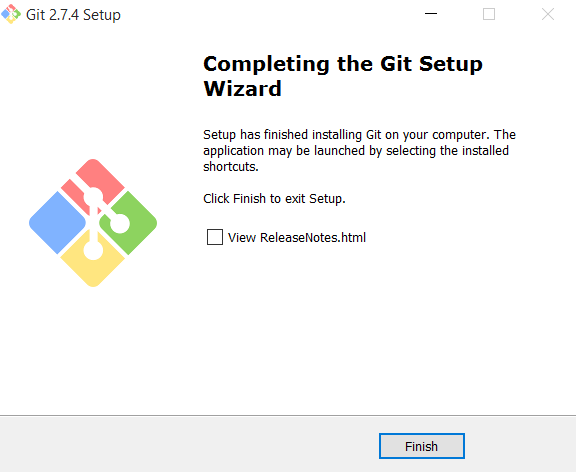

*************
*************
*************
*************
*************


# Chapter 2: Signup for a GitHub account and `hello world` tutorial {.tabset .tabset-fade .tabset-pills}

*************

## Introduction

In this short Chapter, you will signup for a GitHub account. GitHub is like 
your online portfolio of code. It has a plethora of great features for creating 
websites, project pages and collaborating with others. Again GitHub is an 
interface to the version control system called Git. Other options 
include [Bitbucket](https://bitbucket.org/) and [GitLab](https://about.gitlab.com/).


*************
*************
*************
*************
*************
*************
*************
*************
*************
*************
*************
*************
*************
*************
*************
*************
*************
*************


## Step 1

Go to [https://github.com/](https://github.com/).

*************

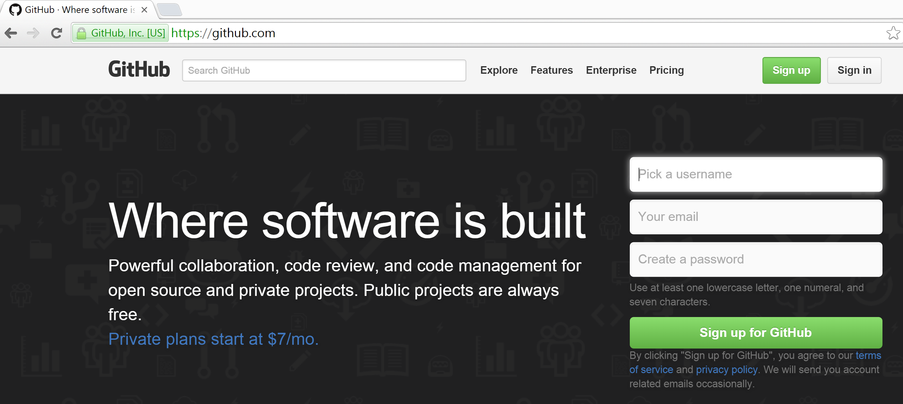

*************
*************
*************
*************
*************

## Step 2

The longest step in this chapter is choosing your username. Think about it 
carefully; it will be how you are recognized on GitHub i.e., your github website 
address will be github.com/username. Once you have chosen a username, enter a 
valid email address and password, and click on the `Sign up for GitHub` button.

*************

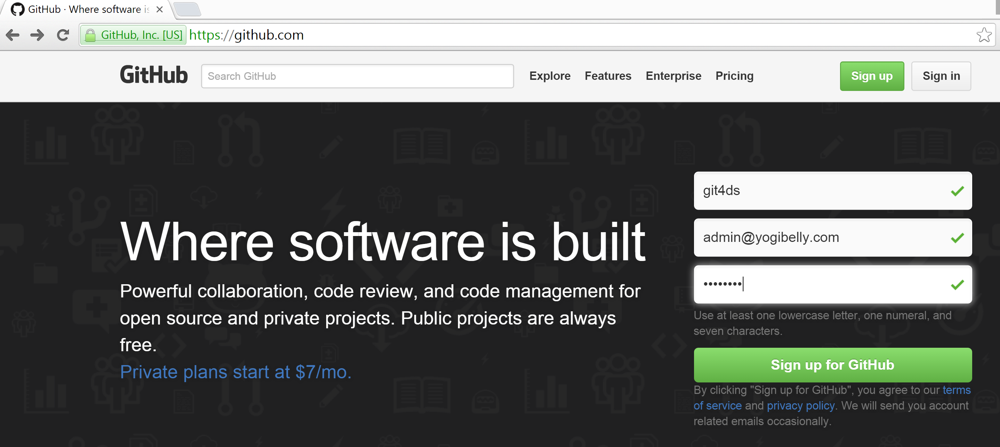

*************
*************
*************
*************
*************

## Step 3

Choose the free plan (default) and click on the `Finish sign up` button. 

*************


*************
*************
*************
*************
*************

## Step 4

Well done. You now have a GitHub account. Complete the `Hello World` guide 
which will walk you through some functionalities of GitHub. Click on 
the `Let's get started!` button. 

*************

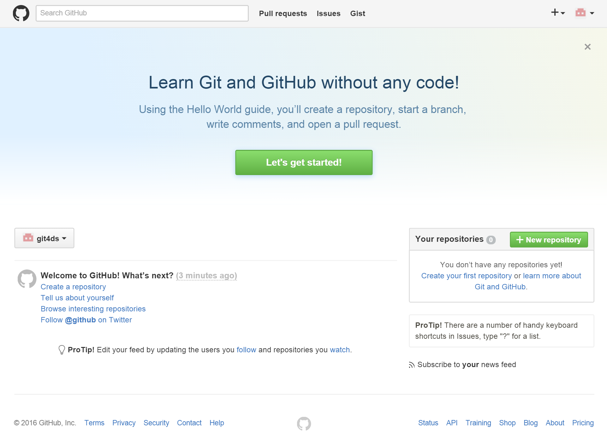

*************
*************
*************
*************
*************

## Step 5

Complete the exercises and move on to Chapter 3: Installing GitHub Desktop. 

*************

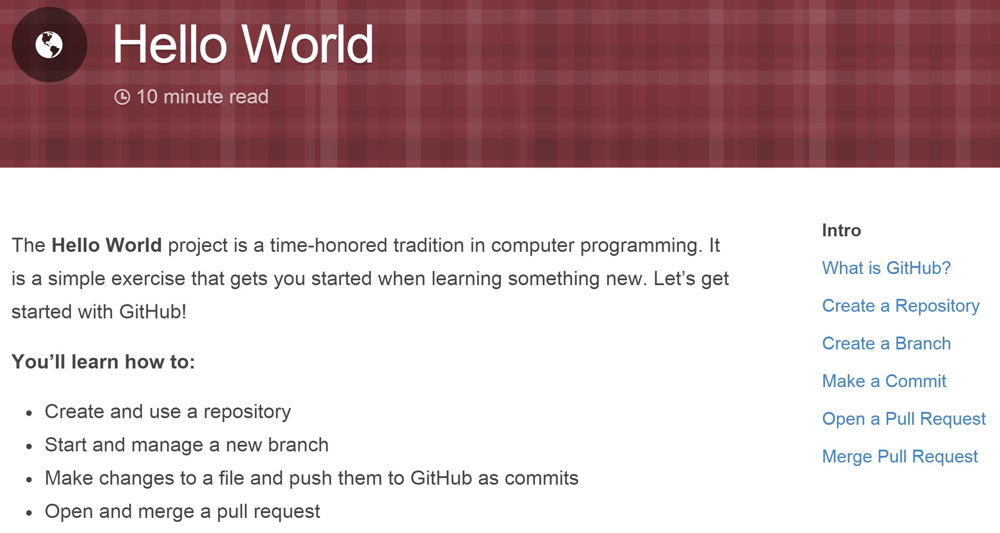

*************
*************
*************
*************
*************

# Chapter 3: Installing GitHub Desktop {.tabset .tabset-fade .tabset-pills}

*************

## Introduction

Traditionally, version control with Git is accessed through the command line or 
terminal. GitHub Desktop is a software program that makes it easier to use Git 
functions without having to use the command line. It also allows you to 
communicate with your GitHub website (github.com/username). Don't worry if the 
differences between Git, GitHub and GitHub Desktop are not clear to you yet. 
You will have a better understanding once you have completed this tutorial. 

_Note: in all the screenshots that follow, my username is shown, however you should be entering your username, password and email address created in Chapter 2._

*************
*************
*************
*************
*************
*************
*************
*************
*************
*************
*************
*************
*************
*************
*************
*************
*************
*************

## Step 1

Go to [https://desktop.github.com/](https://desktop.github.com/) and click 
on `Download GitHub Desktop`. 
_Note: GitHub desktop is only available for Windows and Mac. If you are running Linux I recommend [GitKraken](https://www.gitkraken.com/)._ 

*************

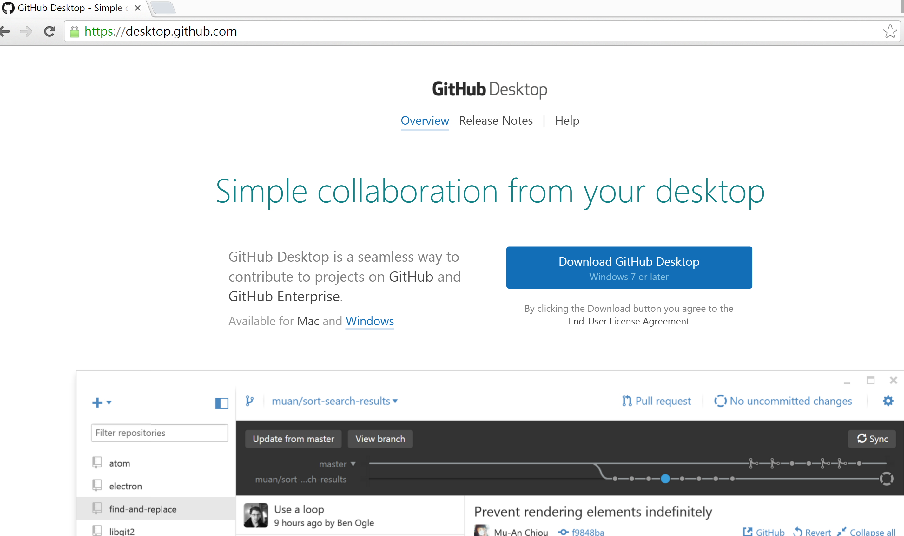

*************
*************
*************
*************
*************


## Step 2

Once the program has finished downloading, click on `GitHubSetup.exe` (or `.dmg` on a Mac).

*************

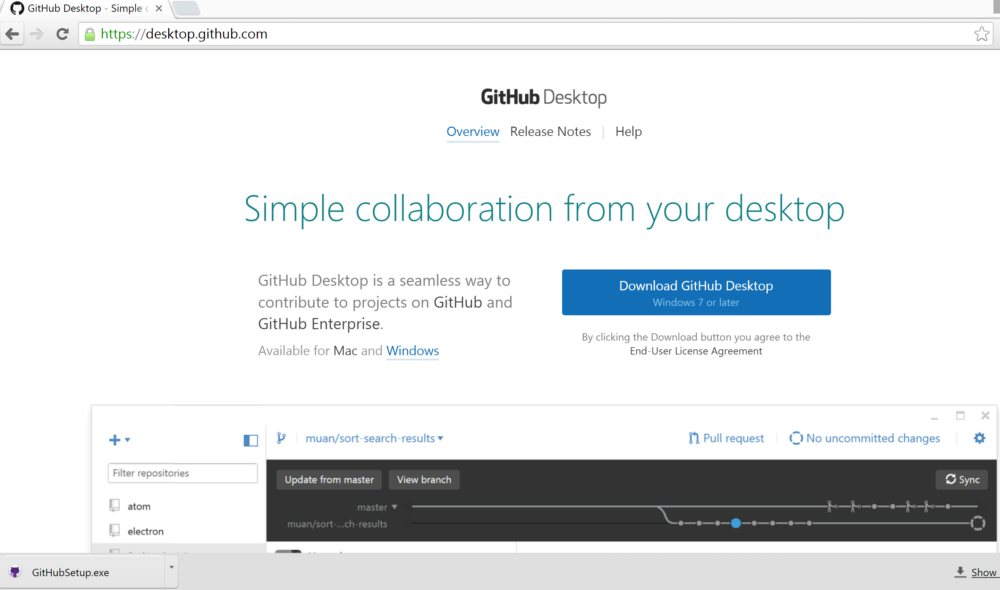

*************
*************
*************
*************
*************


## Step 3

Click on `Install`.

*************

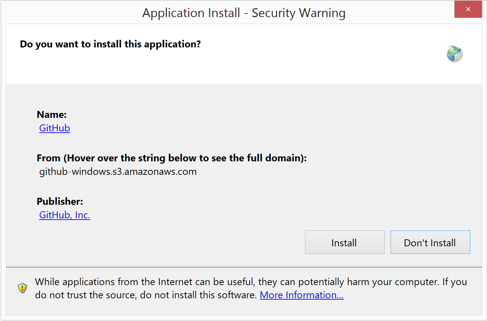

*************
*************
*************
*************
*************


## Step 4

You should see this installation screen.

*************

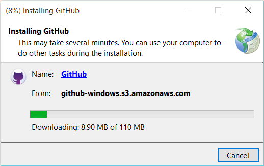

*************
*************
*************
*************
*************


## Step 5

Once installed, open up the program and login using the GitHub username and 
password you created in Chapter 2 and click on `Log in`. 

*************


*************
*************
*************
*************
*************


## Step 6

This information is used to identify the person that made the changes to your 
code. Leave the default values and click on `Continue`. 

*************

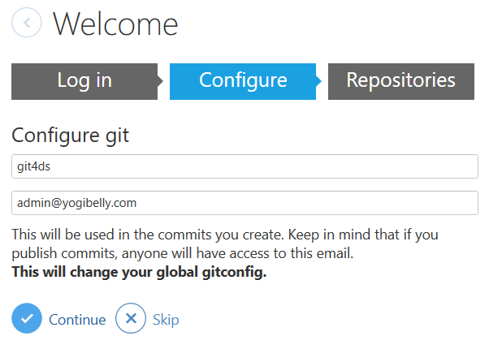

*************
*************
*************
*************
*************


## Step 7

You should see this screen, since you haven't created any local repositories yet. 

> What is a repository? The purpose of Git is to manage a project, or a set of files, as they change over time. Git stores this information in a data structure called a repository^[[https://www.sbf5.com/~cduan/technical/git/git-1.shtml](https://www.sbf5.com/~cduan/technical/git/git-1.shtml)].

*************

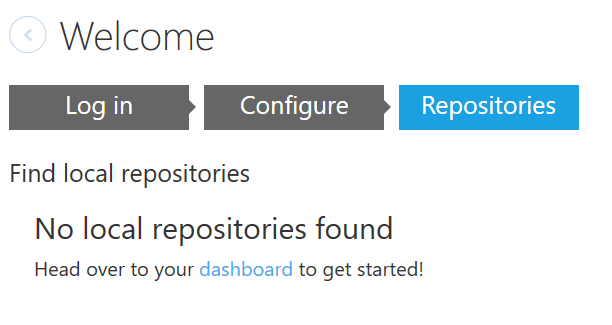

*************
*************
*************
*************
*************


## Step 8

You should now be at this screen.

*************

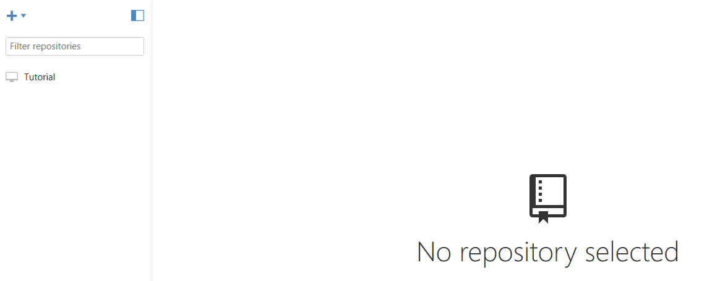

*************
*************
*************
*************
*************


## Step 9

Click on the  button in the top left corner. Your username should appear 
with a list of your repositories that are currently saved in your online GitHub 
account. To be able to have a local copy of this repository (by local I mean on 
your computer hard drive) click on the `Clone` tab and then 
the `Clone hello-world` button (I am assuming that you completed the `Hello World` 
tutorial in Step 5 of Chapter 2).

*************

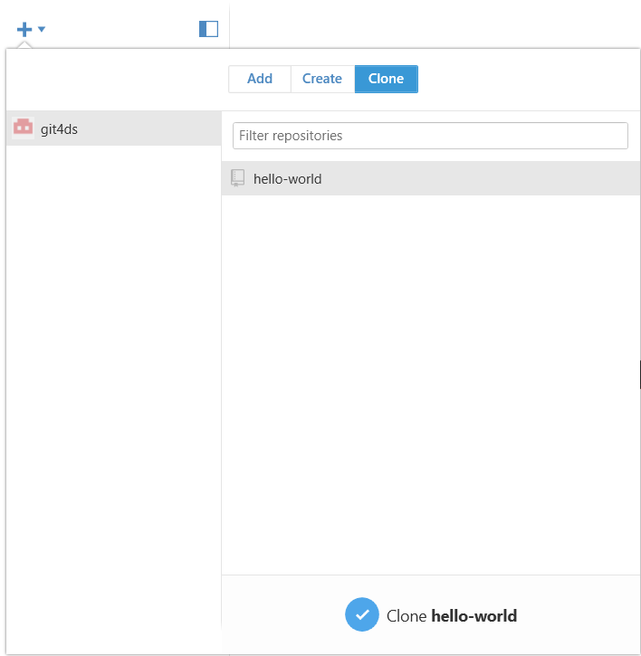

*************
*************
*************
*************
*************


## Step 10

Choose where you want to save a local copy of the `Hello World` repository and click `OK`. 

*************

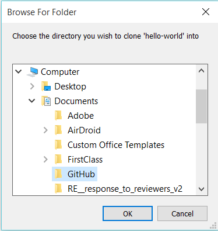

*************
*************
*************
*************
*************


## Step 11

You should now see the following contents in your GitHub desktop program.

*************


*************
*************
*************
*************
*************


## Step 12

Using your computer's file explorer (e.g. windows explorer or mac finder), 
locate the local GitHub repository. If you successfully cloned your repository 
you will see a `hello-world` folder with a `README.md` file in it, which is 
the same one you created during the `Hello World` exercise in Chapter 2.

*************


*************
*************
*************
*************
*************


## Step 13

Before moving on to Chapter 4, verify that the GitHub Desktop has added an 
SSH key for you. An SSH key is used to establish a secure connection between 
your computer and the online GitHub server. On the far top right hand side of 
your online GitHub account click on the  icon and navigate to `Settings`. 

*************


*************
*************
*************
*************
*************


## Step 14

You should see one entry in the `SSH keys` panel. Well done. You are now ready 
to version control some `R` code in Chapter 4. 

*************


*************
*************
*************
*************
*************


# Chapter 4: Version control `R` code using an example of PCA {.tabset .tabset-fade .tabset-pills}

*************

## Introduction

In this chapter we will learn how to version control `R` code using an example 
of Principal Component Analysis.

*************
*************
*************
*************
*************
*************
*************
*************
*************
*************
*************
*************
*************
*************
*************
*************
*************
*************

## Step 1

Create a local (meaning on your computer) repository by clickling the  
button in the top left corner of GitHub Desktop, and select the `Create` tab. 
Name the repository `pcaCars` and select where you want this repository stored 
on your computer. Leave the `Git ignore` value at its default (we will ignore what
this is for now). Click on .

*************

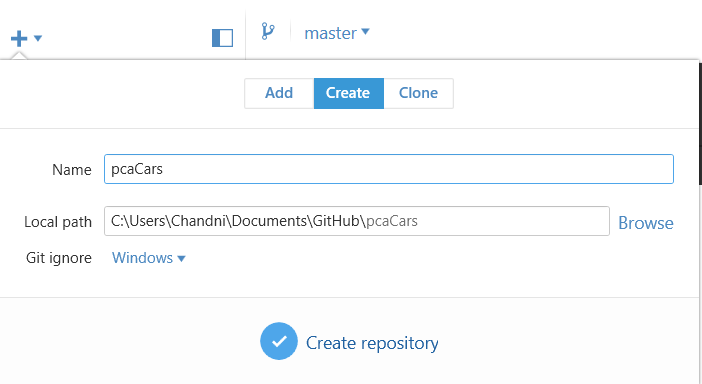

*************
*************
*************
*************
*************


## Step 2

You should see the following in your GitHub Desktop. A repository called 
`pcaCars` has been created locally on your computer, and it contains two 
text files that were automatically created by the software. You can click on them 
to see their contents. The most important of the two is the `.gitignore` file. 
This text file allows you to control what you want to version control within the
`pcaCars` repository. 

*************

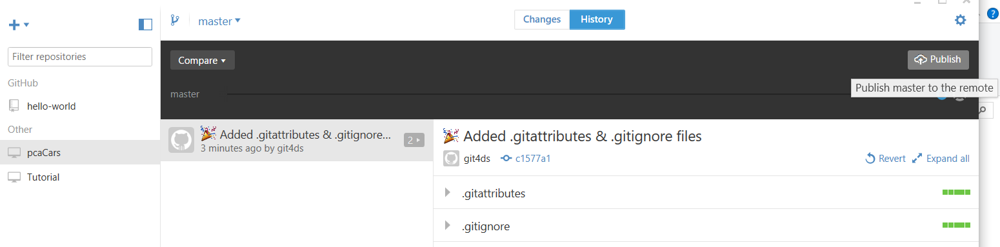

*************
*************
*************
*************
*************


## Step 3

We now want to publish this repository to the remote (i.e. github.com/username). 
Simply click on the 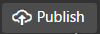 
button in the top right hand corner. Add a description
and click on .

*************

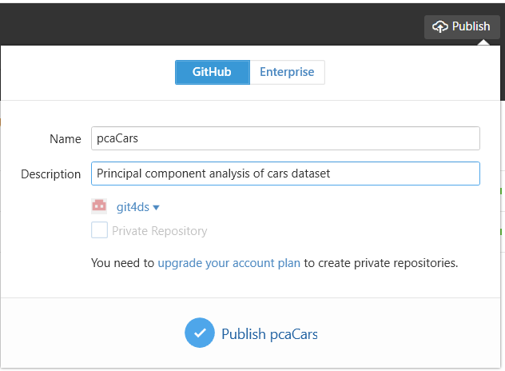

*************
*************
*************
*************
*************


## Step 4

Head over to your online github account (e.g. [https://github.com/git4ds](https://github.com/git4ds)). 
You should see the `pcaCars` repository along with the description you entered in the 
previous step. 


*************

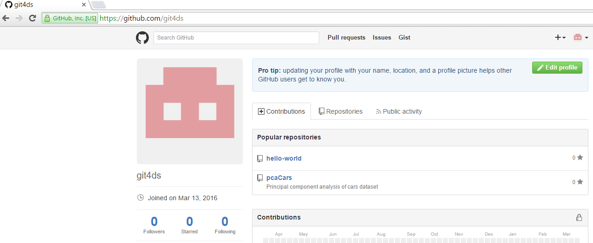

*************
*************
*************
*************
*************


## Step 5

Click on the `pcaCars` repository and you will see the `.gitattributes` and 
`.gitignore` files which are the same ones you have in your local repository.

*************

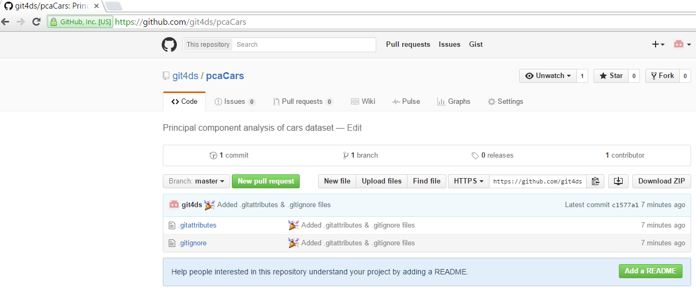

*************
*************
*************
*************
*************


## Step 6

Open RStudio, navigate to the `pcaCars` repository and set it as your working
directory using the `setwd()` function

*************

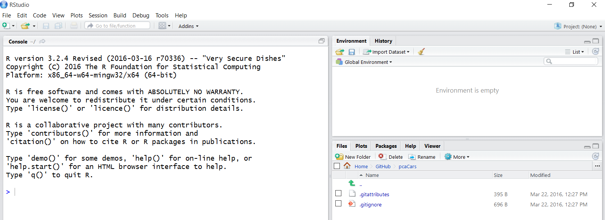

*************
*************
*************
*************
*************


## Step 7

Save the following code in an R script called `pca.R`

```{r eval=FALSE}
# cor = TRUE indicates that PCA is performed on 
# standardized data (mean = 0, variance = 1)
pcaCars <- princomp(mtcars, cor = TRUE)

# view objects stored in pcaCars
names(pcaCars)

# proportion of variance explained
summary(pcaCars)

# scree plot
plot(pcaCars, type = "l")
```


*************


*************
*************
*************
*************
*************


## Step 8

Go back to GitHub Desktop. You will see the `pca.R` file appear. Click on the
checkbox to the left of it, and you will see all the additions you have made
to the file. 


*************

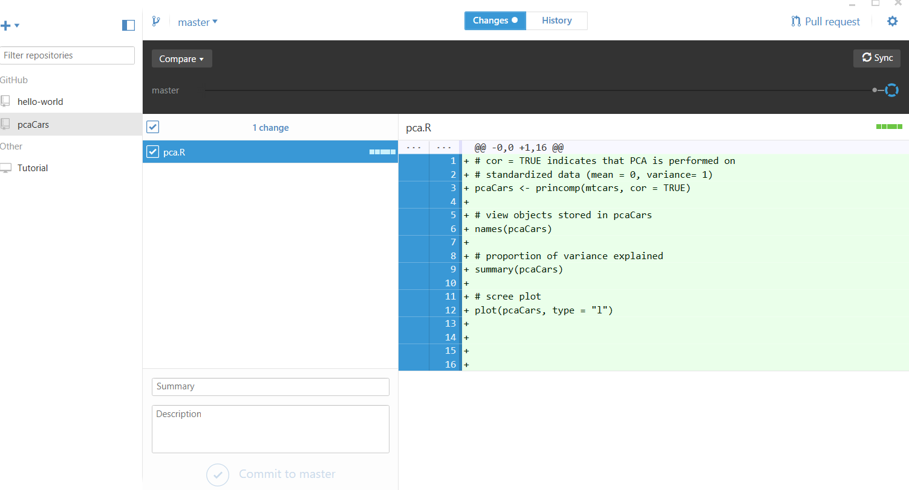

*************
*************
*************
*************
*************


## Step 9

On the bottom left hand side, enter a summary of the changes you have made to 
the repository and an (optional) description. Then click on . 
This is essentially telling Git to record the changes you have made and store them
in a branch. We will learn about branches in Chapter 5.

*************

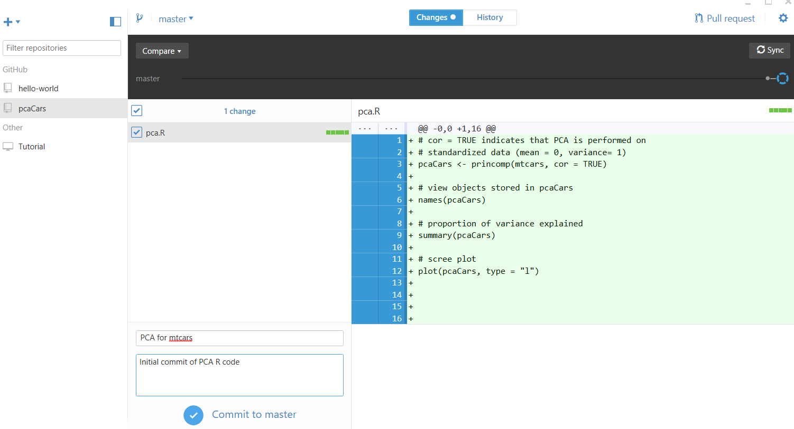

*************
*************
*************
*************
*************


## Step 10

You should see the following screen. You should notice that in the rectangular 
black box, underneath the  
button in the top right hand corner of GitHub Desktop,
a timeline. As you commit additional changes, this timeline will grow. Each circle represents
a snapshot of the repository at the time of the commit. This is the power of version controlling with 
Git. You can see what changes you have made, and even revert back to snapshot you want. 

*************

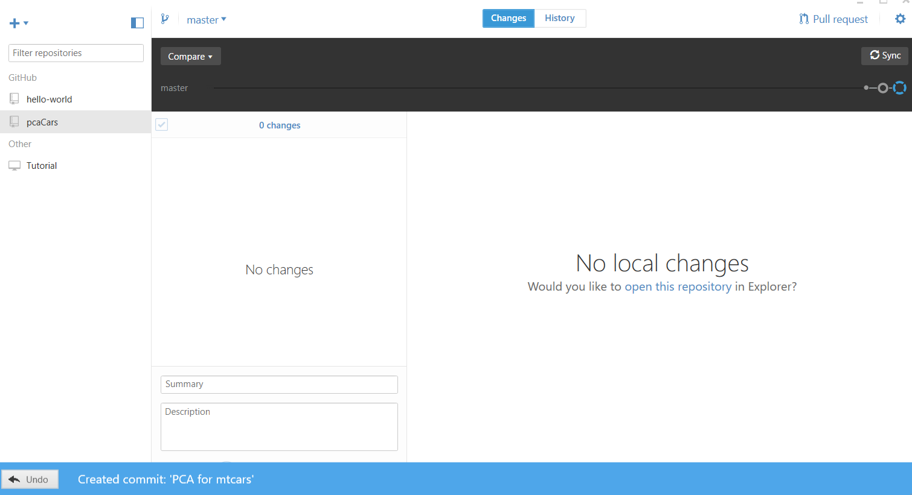

*************
*************
*************
*************
*************


## Step 11

Go to the `pcaCars` repository in your online GitHub account. Do you see the 
file you just created called `pca.R` ? _Why not?_ Because the commit you made was local
to your computer. In order to see these changes online, you must `push` your local
changes to the `remote`. 

*************

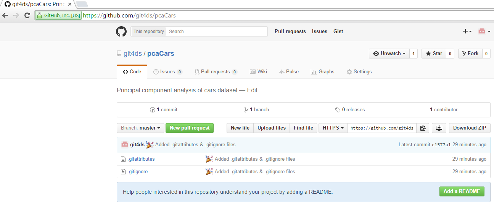

*************
*************
*************
*************
*************


## Step 12

Go to GitHub Desktop and click on the  
button in the top right hand corner.

*************

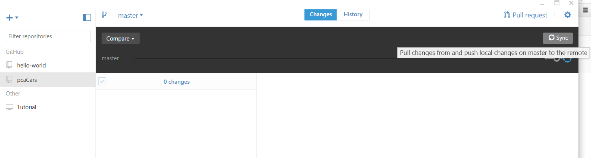

*************
*************
*************
*************
*************


## Step 13

You should now see your local changes _pushed_ to your online repository. 

*************

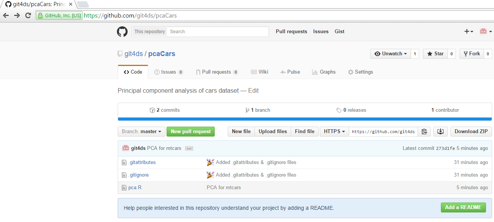

*************
*************
*************
*************
*************


## Step 14

Let's make a change to the `pca.R` script. Instead of a scree plot, we want
a bar plot of the variance explained for each component:

```{r, eval=FALSE}
# bar plot
plot(pcaCars)
```

Your script should now match what is shown in the screenshot below.

*************

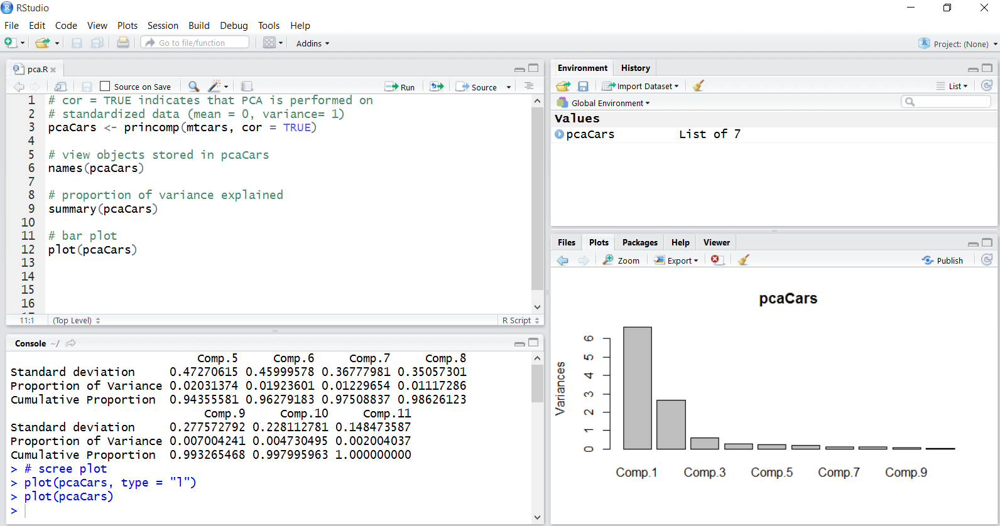

*************
*************
*************
*************
*************

## Step 15

Go to GitHub Desktop and click on the `pca.R` file. You will see that 
Git automatically recognizes the changes you have made. Highlighted in red
is what has been removed from the file, and in green is what was added. 

*************

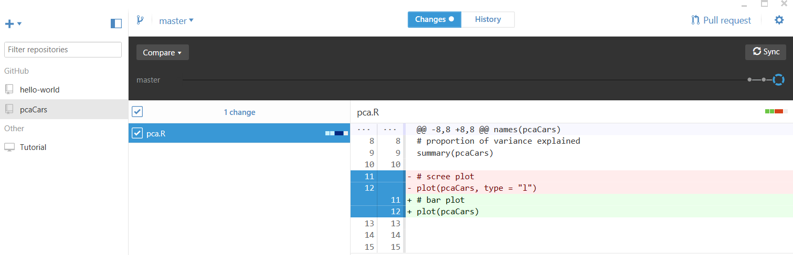

*************
*************
*************
*************
*************

## Step 16

Describe the change you have made and click on 

*************

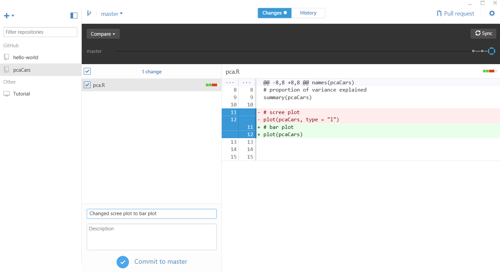

*************
*************
*************
*************
*************

## Step 17

_Push_ your local changes to the remote repository by clicking on the  
button. You can view the different commits you have made in GitHub Desktop by clicking on 
the grey circles in the timeline located in the rectangular black box.

*************


*************
*************
*************
*************
*************

## Step 18

Go to your GitHub account online to see that the changes have been updated. Click on the `History` button located in  to see a list of commits you have made to the repository. 

*************

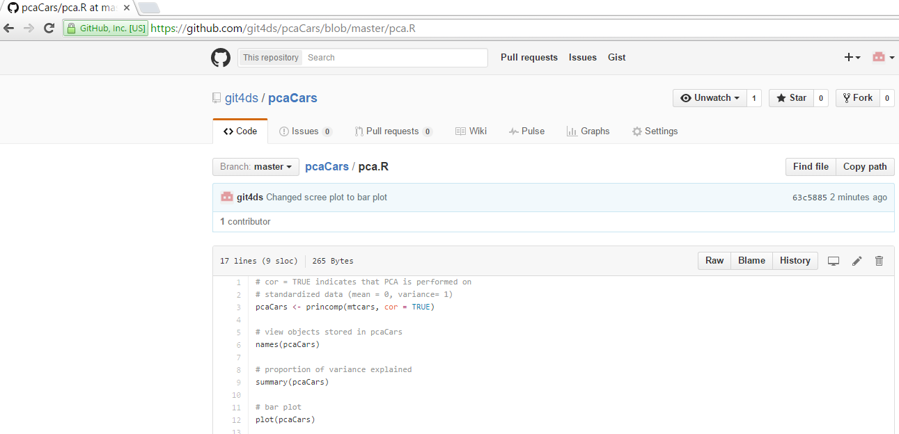

*************
*************
*************
*************
*************

## Step 19

The `History` of commits you have made to the repository.

*************

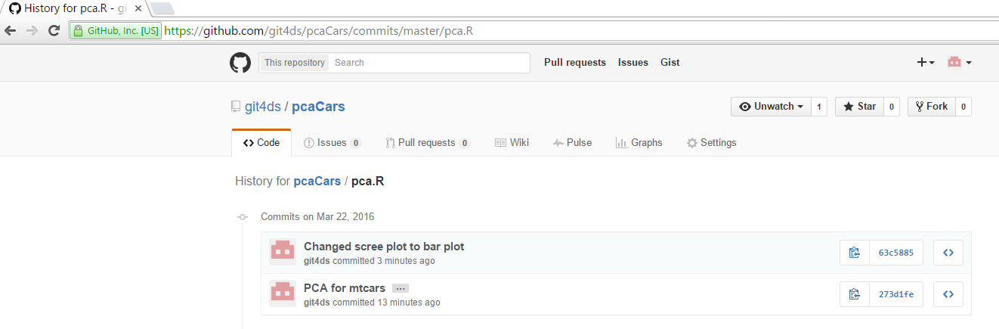

*************
*************
*************
*************
*************


# Chapter 5: Create a branch, pull request, merge {.tabset .tabset-fade .tabset-pills}

*************

## Introduction 

In this chapter you will learn what the words `branch`, `pull request` and `merge` mean
in the GitHub world. _Branching_ is a much more efficient and safe alternative to 
having files in a project like this:

- pcaCars_v1.R
- pcaCars_v2_hierarchical_clustering_Sept_2015.R
- pcaCars_v3_bayesian_clustering_not_working.R

This image^[[https://confluence.atlassian.com/bitbucket/use-a-git-branch-to-merge-a-file-681902555.html](https://confluence.atlassian.com/bitbucket/use-a-git-branch-to-merge-a-file-681902555.html)] nicely summarises what _branching_ is useful for:

*************

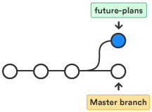

*************

When you have a new idea, or want to test out some existing method but don't want to
modify your working script, then creating a branch is what you should do. 

> A branch represents an independent line of development. You can think of 
them as a way to request a brand new working directory^[[https://www.atlassian.com/git/tutorials/using-branches](https://www.atlassian.com/git/tutorials/using-branches)].

*************
*************
*************

## Step 1

Click on the branch symbol  and 
name the branch `clustering`. The `From branch` entry indicates what the starting point of the `clustering` 
branch should be (you will see what this means shortly). Since there are no other branches
present, `master` is chosen by default. Click on .

*************

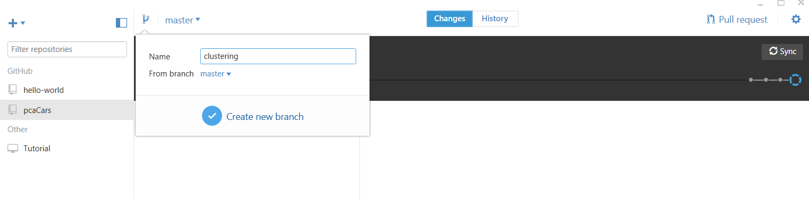

*************
*************
*************
*************
*************


## Step 2

You have now switched to the `clustering` branch. Notice the second timeline 
labelled `clustering` underneath the `master` in the black rectangular box.

*************

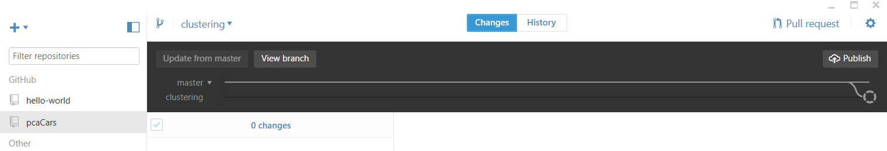

*************
*************
*************
*************
*************


## Step 3

You will also see a list of branches in this repository in the dropdown list
next to the branch symbol . 
The checkmark indicates the branch you are currently on. 

*************

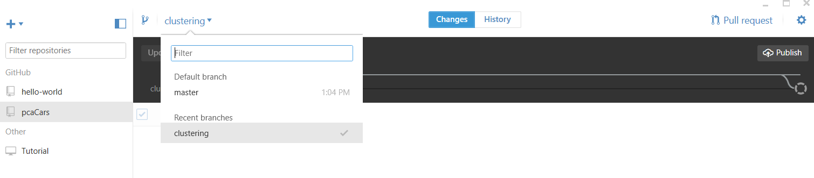

*************
*************
*************
*************
*************


## Step 4

The motivation for creating this branch is that we want test out some code
to cluster the cars based on principal component scores. Go to RStudio and add 
the following code to `pca.R` and save the file. You will need to install the 
[`ggplot2`](https://cran.r-project.org/web/packages/ggplot2/) and 
[`ggrepel`](https://cran.r-project.org/web/packages/ggrepel/index.html) packages from CRAN

```{r eval=FALSE}
# cluster cars
carsHC <- hclust(dist(pcaCars$scores), method = "ward.D2")

# dendrogram
plot(carsHC)

# cut the dendrogram into 3 clusters
carsClusters <- cutree(carsHC, k = 3)

# add cluster to data frame of scores
carsDf <- data.frame(pcaCars$scores, "cluster" = factor(carsClusters))
str(carsDf)

# plot the first 2 PCs with cluster membership
# need to install ggplot2 and ggrepel packages first
# using the following command in R: 
# install.packages(c("ggplot2","ggrepel"))
library(ggplot2)
library(ggrepel)
ggplot(carsDf,aes(x=Comp.1, y=Comp.2)) +
  geom_text_repel(aes(label = rownames(carsDf))) +
  theme_classic() +
  geom_hline(yintercept = 0, color = "gray70") +
  geom_vline(xintercept = 0, color = "gray70") +
  geom_point(aes(color = cluster), alpha = 0.55, size = 3) +
  xlab("PC1") +
  ylab("PC2") + 
  xlim(-5, 6) + 
  ggtitle("PCA plot of Cars")
```


*************

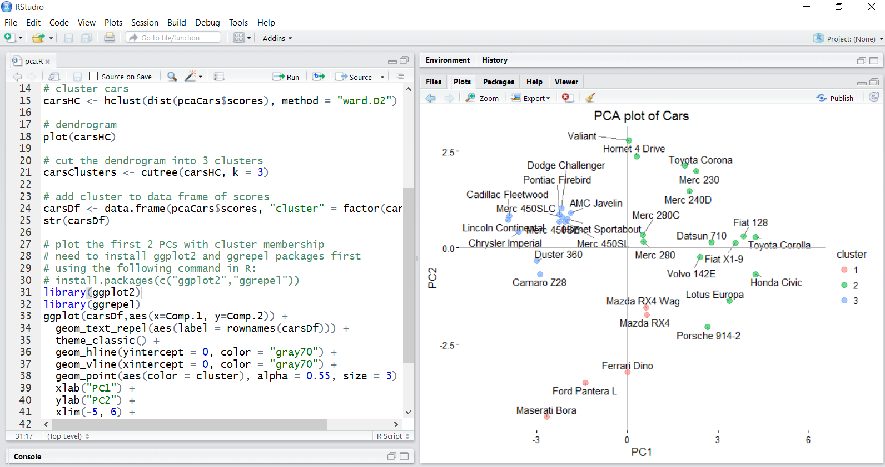

*************
*************
*************
*************
*************


## Step 5

Go to GitHub Desktop, click on the `pca.R` file and you will see the changes made
have been highlighted. Describe the changes you have made and then click on 
. 

*************

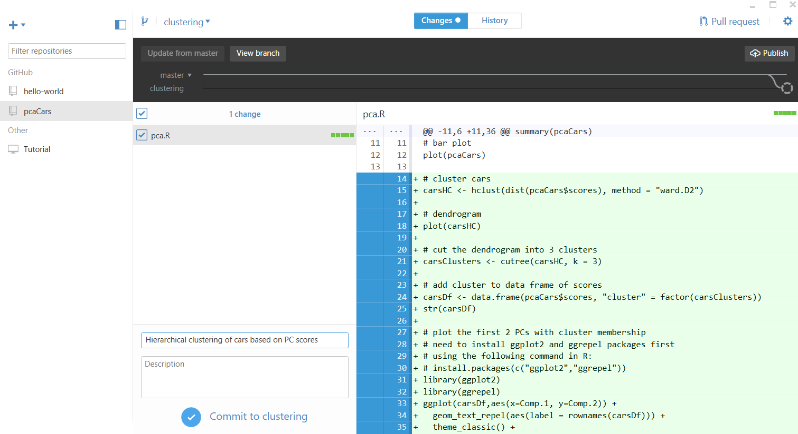

*************
*************
*************
*************
*************


## Step 6

_Push_ your local change to your online GitHub repository (i.e. the _remote_) 
by clicking on the 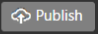 button. 

*************

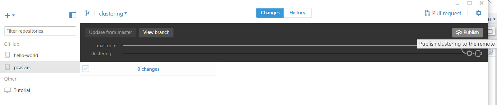

*************
*************
*************
*************
*************


## Step 7

You will see the `clustering` branch appear in the `Branch` dropdown menu. 

*************

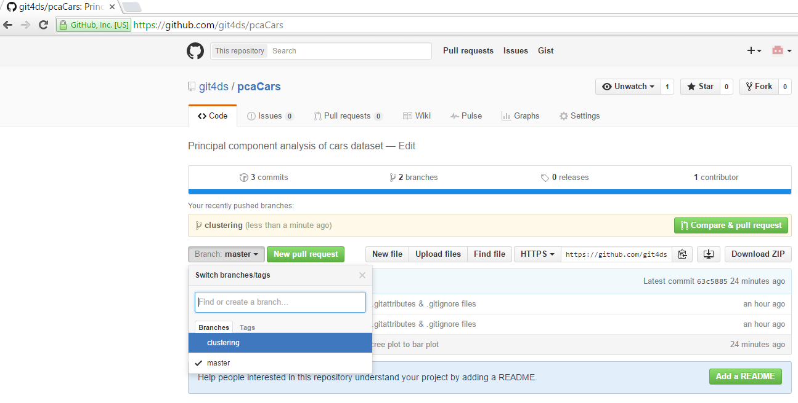

*************
*************
*************
*************
*************


## Step 8

Select the `clustering` branch and confirm that your changes to the `pca.R` script
are there. 

*************

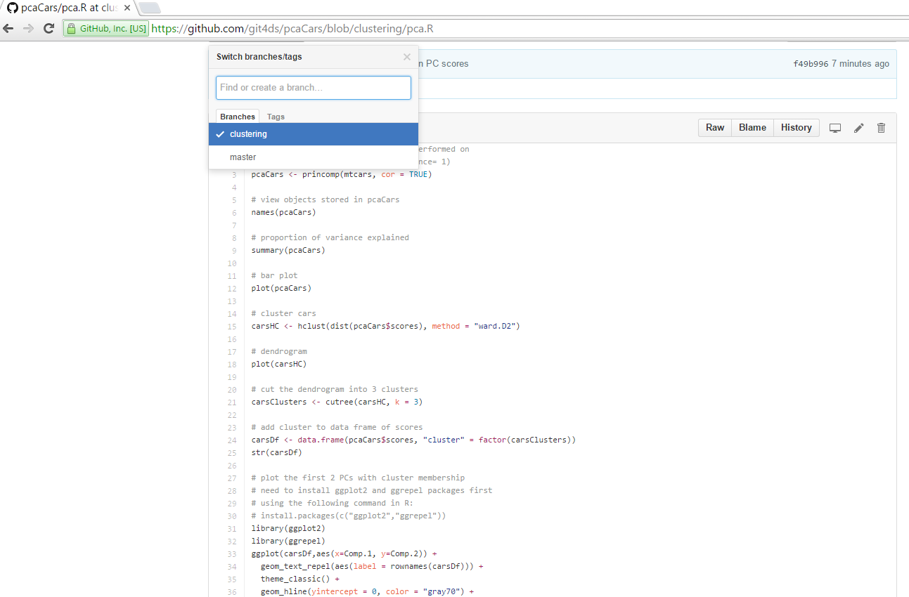

*************
*************
*************
*************
*************


## Step 9

Switch back to the `master` branch. _Why isn't the clutering code there?_ Because
you _commit_ your changes to the `clustering` branch and _not_ the `master` branch. 
It should become a little more clear now what _branching_ is and it's utility.

*************

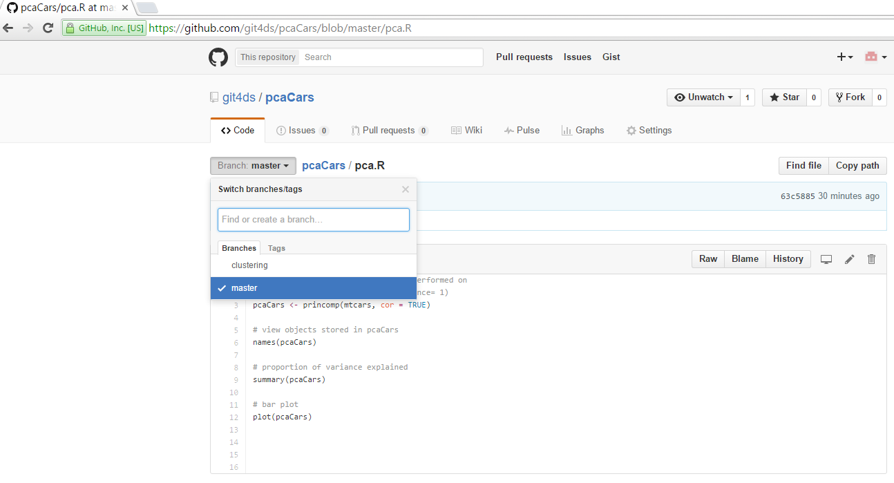

*************
*************
*************
*************
*************


## Step 10

If you're content with the clustering results, it's time to merge the clustering code 
which is sitting on the `clustering` branch with the PCA code on the `master` branch. 
This is accomplished via a `pull request`. A `pull request` is the first step in merging two branches. 
It tells GitHub that you have committed changes to the repository and allows you to review the changes. 
_Note: `pull requests` are a GitHub functionality and is not part of Git._ 

************

Click on the  button in GitHub Desktop, enter a summary and description
of the proposed changes and why you did them. Then click on . 

*************

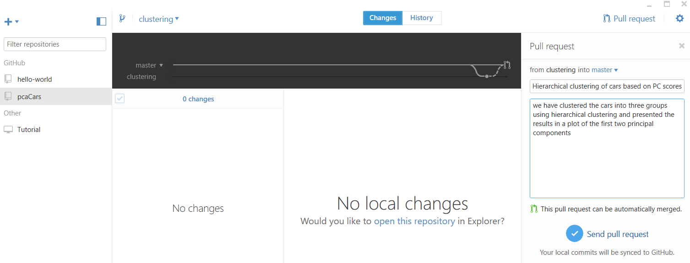

*************
*************
*************
*************
*************


## Step 11

Click on `View it on GitHub`. This will open the submitted `pull request` in the 
`pcaCars` repository of your online GitHub account.

*************

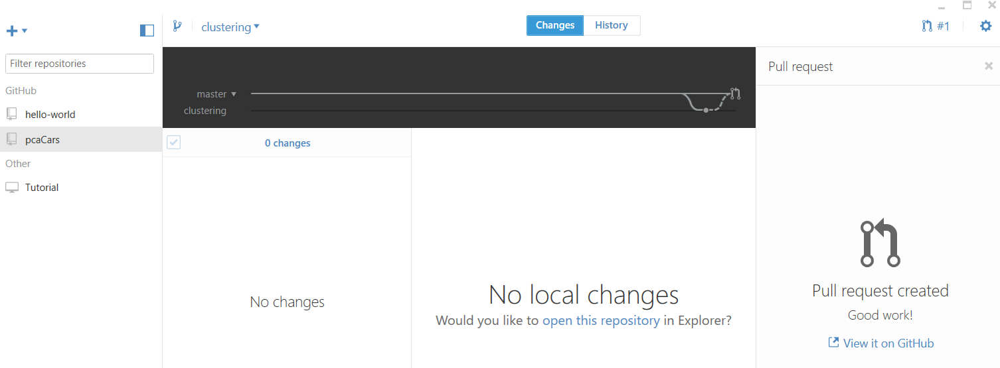

*************
*************
*************
*************
*************


## Step 12

GitHub will automatically check that the merge can be completed without any 
conflicts. If there are no conflicts you will see the following screen. Click on 
. 

*************

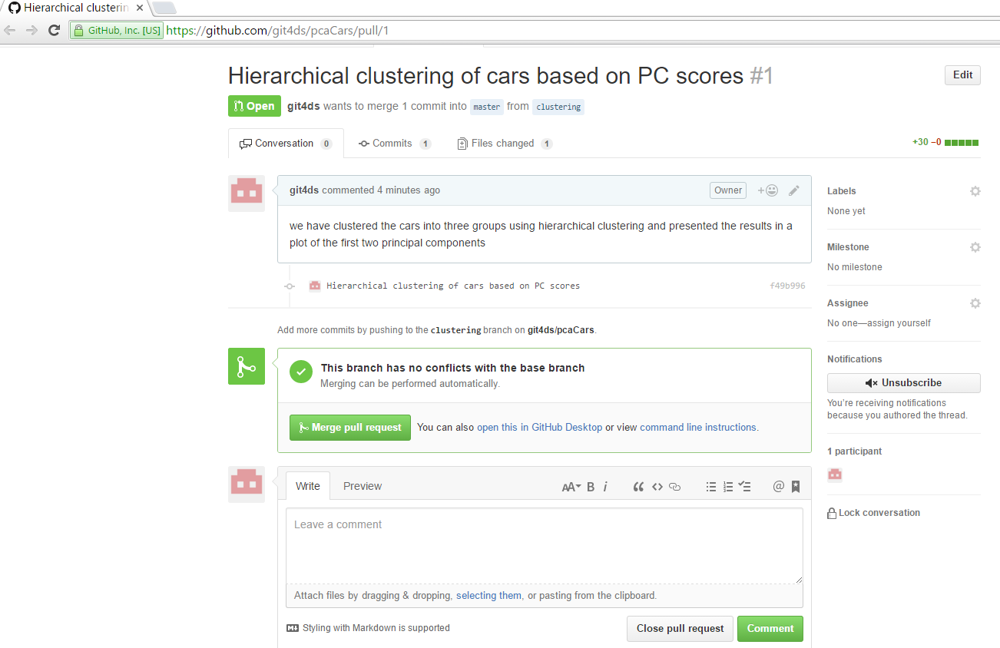

*************
*************
*************
*************
*************


## Step 13

Enter a comment about the pull request (optional) and click on .

*************

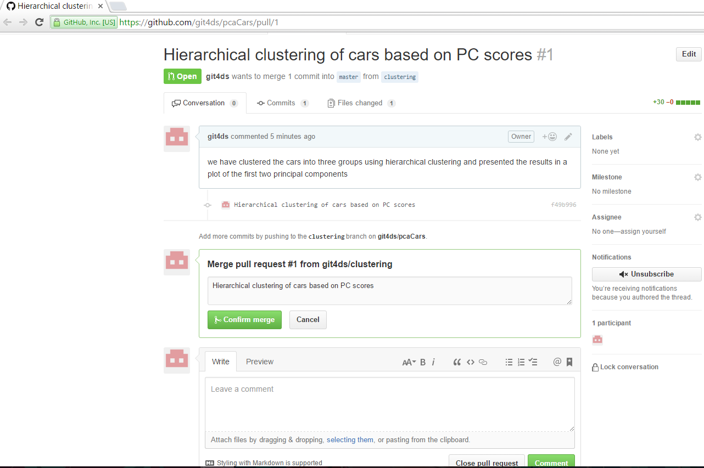

*************
*************
*************
*************
*************


## Step 14

Well done. You have successfully created a _branch_, submitted a _pull request_ and 
_merged_ your changes from the `clustering` branch to the `master` branch. You can 
delete the `clustering` branch by clicking on  as it is no longer needed because these changes
are now in the `master` branch. 

*************

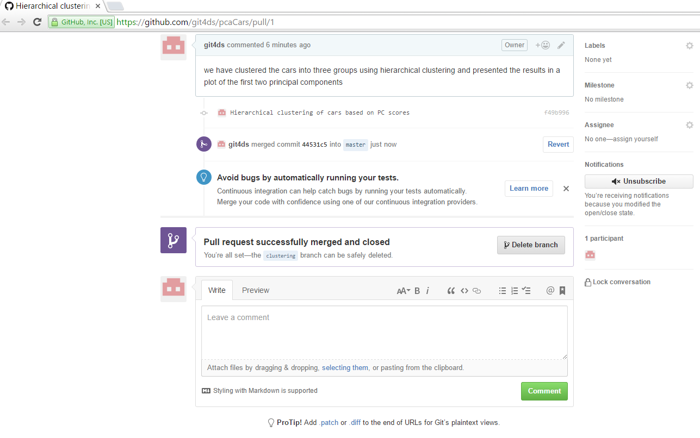

*************
*************
*************
*************
*************

## Step 15

In the `Branch` dropdown list you will only see the `master` branch. You will 
also notice that the clustering code has been merged with the PCA code. 

*************

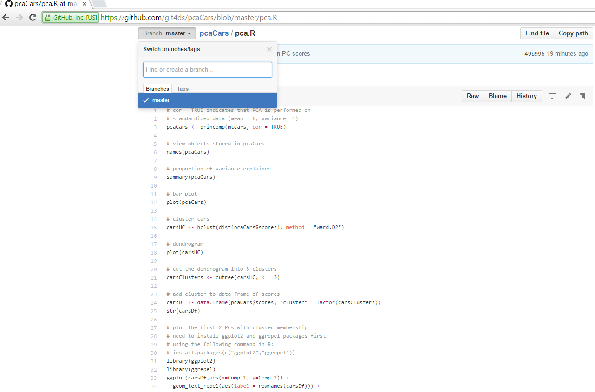

*************
*************
*************
*************
*************

## Step 16

The _merge_ was done online. We now want to see these changes reflected on our
computer (i.e. _locally_). To do this, go to GitHub Desktop and click on 
the  button.  

*************

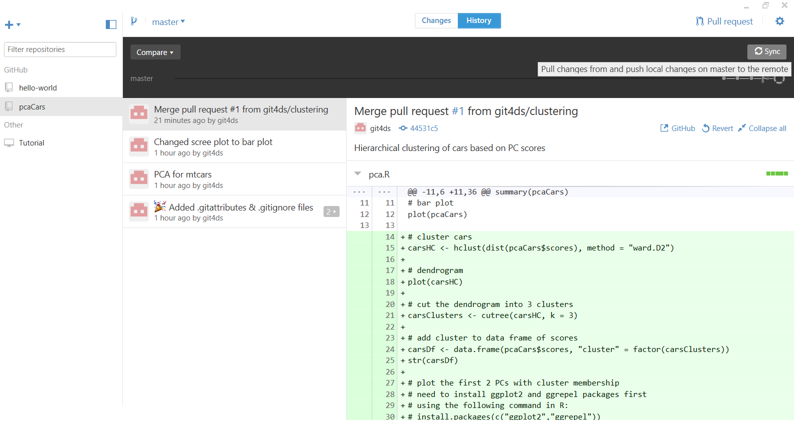

*************
*************
*************
*************
*************

## Step 17

Notice that the `clustering` branch still exists even though you delete it 
in your online GitHub repository. _Why?_ Because you did not delete the branch 
locally (i.e. it still exists on your computer). Click on the settings dropdown menu
and select `Delete clustering...`. 

*************

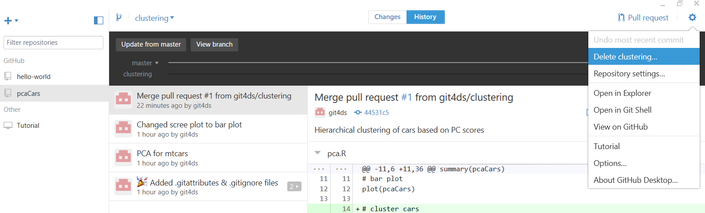

*************
*************
*************
*************
*************

## Step 18

You will now only see the master branch in both the dropdown list and the black
rectangular box. 

*************

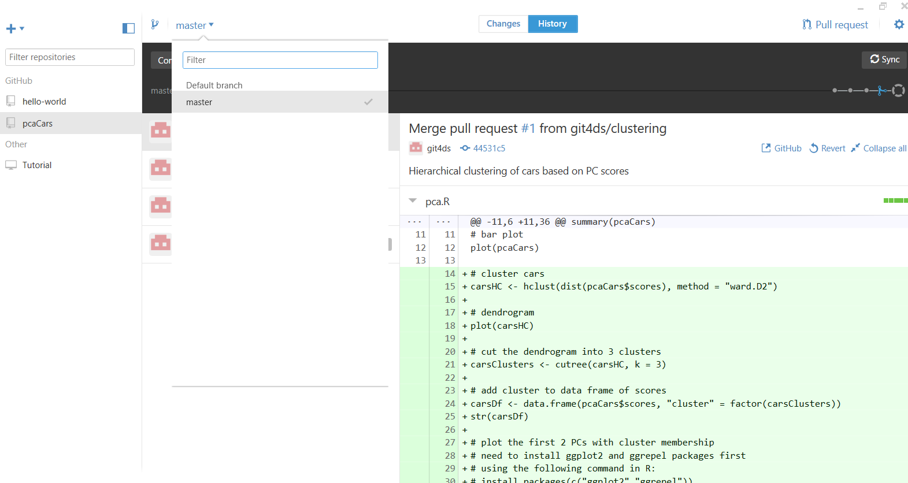

*************
*************
*************
*************
*************


# Chapter 6: Brief Intro to Rstudio Git functionality {.tabset .tabset-fade .tabset-pills}

*************

## Introduction

RStudio also has the ability to interact with Git and GitHub, similar to 
GitHub Desktop. I will briefly show how to initiate this by creating an 
`RStudio project`. More comprehensive resources can be found 
[here](http://www.datasurg.net/2015/07/13/rstudio-and-github/) and
[here](http://r-pkgs.had.co.nz/git.html).

*************
*************
*************
*************
*************
*************
*************
*************
*************
*************
*************
*************
*************
*************
*************
*************
*************
*************

## Step 1

In RStudio go to `File -> New Project ...`

*************

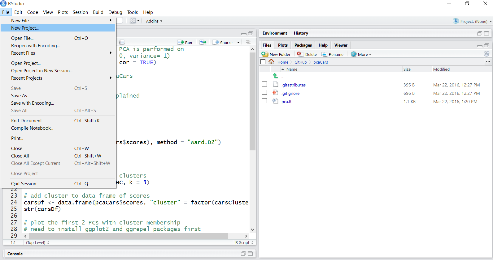

*************
*************
*************
*************
*************


## Step 2

Choose the second option: `Existing Directory` and select the folder which
contains the `pcaCars` repository.

*************

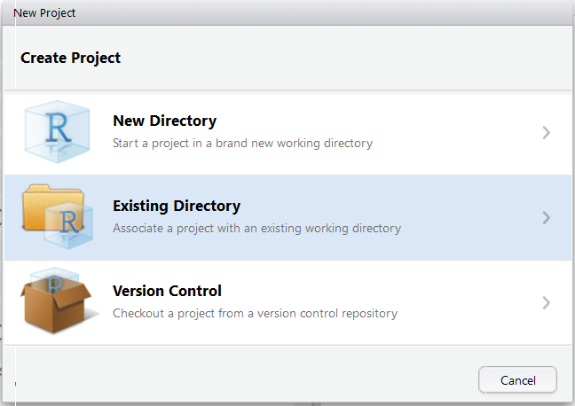

*************
*************
*************
*************
*************


## Step 3

Notice the `Git` tab in 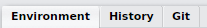 located in the top right panel. It is empty
because no changes have been made to the repositor.

*************

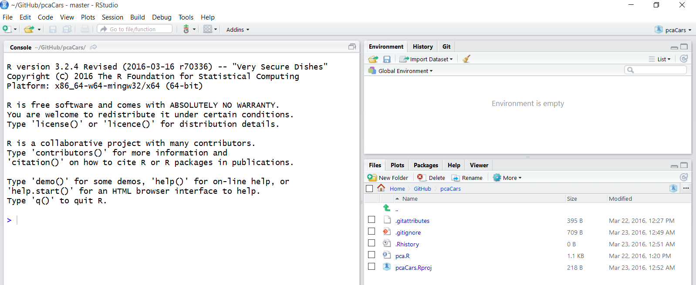

*************
*************
*************
*************
*************


## Step 4

We don't want to version control the files associated with the RStudio project.
Open the `.gitignore` file

*************

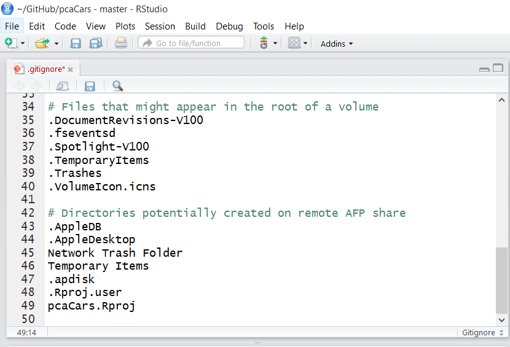

*************
*************
*************
*************
*************


## Step 5

Add the names of these files in the `.gitignore` text file as shown in the 
screenshot below and save the file.

*************

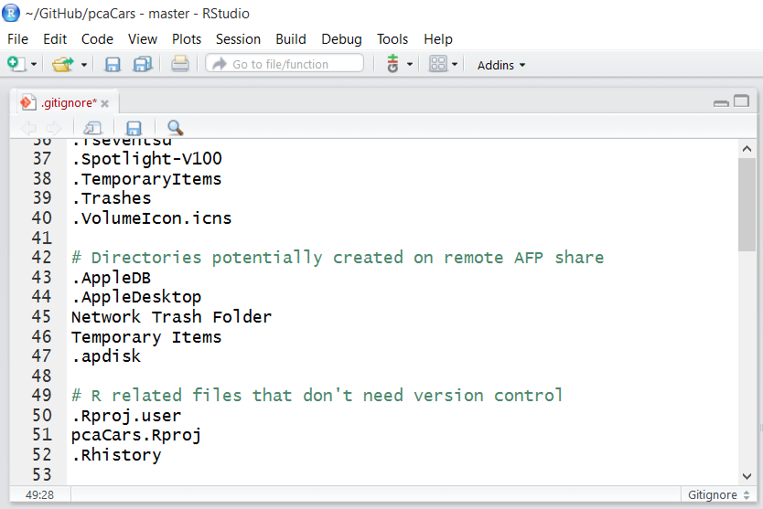

*************
*************
*************
*************
*************


## Step 6

In the `Git` tab you will now notice the `.gitignore` file has appeared because
you have made changes to it. 

*************


*************
*************
*************
*************
*************


## Step 7

You will also notice these changes in GitHub Desktop. 

*************

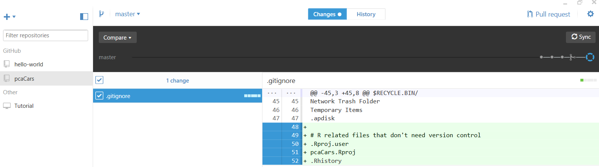

*************
*************
*************
*************
*************


## Step 8

Describe the commit and click on . 

*************

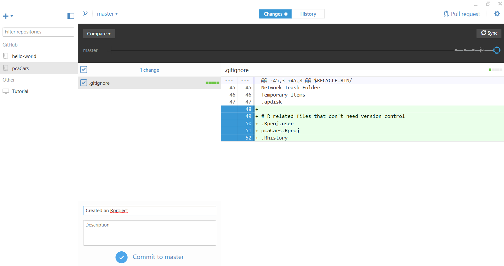

*************
*************
*************
*************
*************


## Step 9

`Sync` the _local_ repository with the _remote_ by clicking on the  button. 

*************

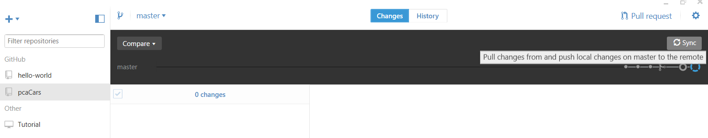

*************
*************
*************
*************
*************


## Step 10

RStudio can also handle _branches_. To see this, click on the branch symbol 
, and create
a branch called `gh-pages`. To do this, enter `gh-pages` in the Name field and click on 

*************


*************
*************
*************
*************
*************


## Step 11

In RStudio you should see a dropdown list of branches in the top right hand
corner of the `Git` panel. You should now be in the `gh-pages` branch for Chapter 7.
_Note: this branch must be called `gh-pages`; you will find out why in the next chapter_

*************

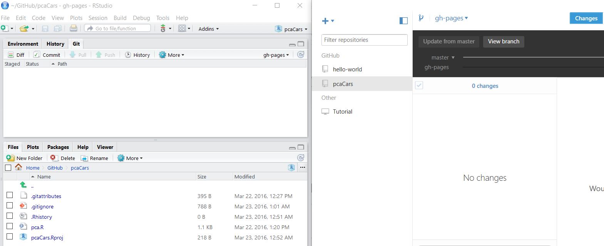

*************
*************
*************
*************
*************


# Chapter 7: Create and publish an RMarkdown document {.tabset .tabset-fade .tabset-pills}

*************

## Introduction

In this chapter you will learn how to create an HTML report (of the PCA you did in 
earlier chapters) using [`RMarkdown`](http://rmarkdown.rstudio.com/). You will 
then learn how to publish this report online. **The following steps must be completed on the `gh-pages` branch**

*************
*************
*************
*************
*************
*************
*************
*************
*************
*************
*************
*************
*************
*************
*************
*************
*************
*************

## Step 1

In RStudio, click on the 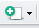 dropdown
list and select `R Markdown...`. 

*************

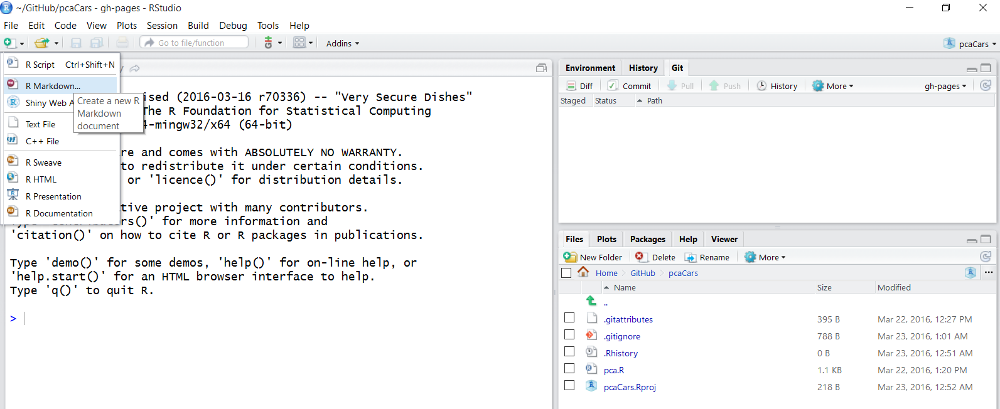

*************
*************
*************
*************
*************


## Step 2

If you don't have the required packages, RStudio will automatically install them.
Click `Yes`.

*************

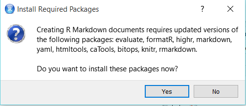

*************
*************
*************
*************
*************


## Step 3

This screen appears to indicate the installation of required packages to use
`R Markdown`.

*************

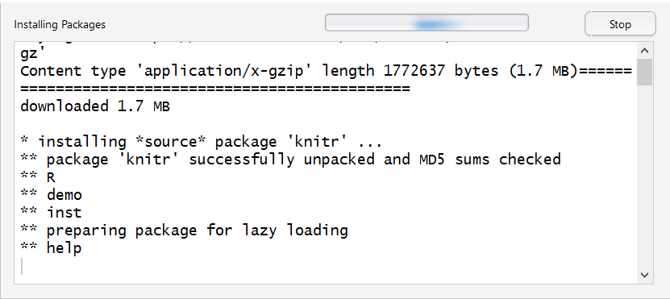

*************
*************
*************
*************
*************


## Step 4

Enter a title and author. Ensure that the `Default Output Format` is HTML. 
Click on `OK`.

*************

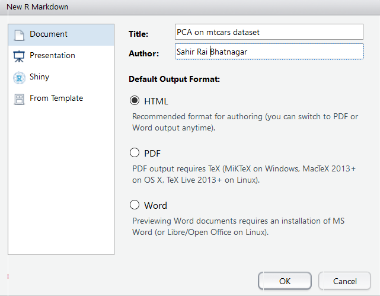

*************
*************
*************
*************
*************


## Step 5

To ensure everything is working correctly compile the document by clicking on 
the  button. 
This will convert the `R Markdown` document to HTML. 


*************

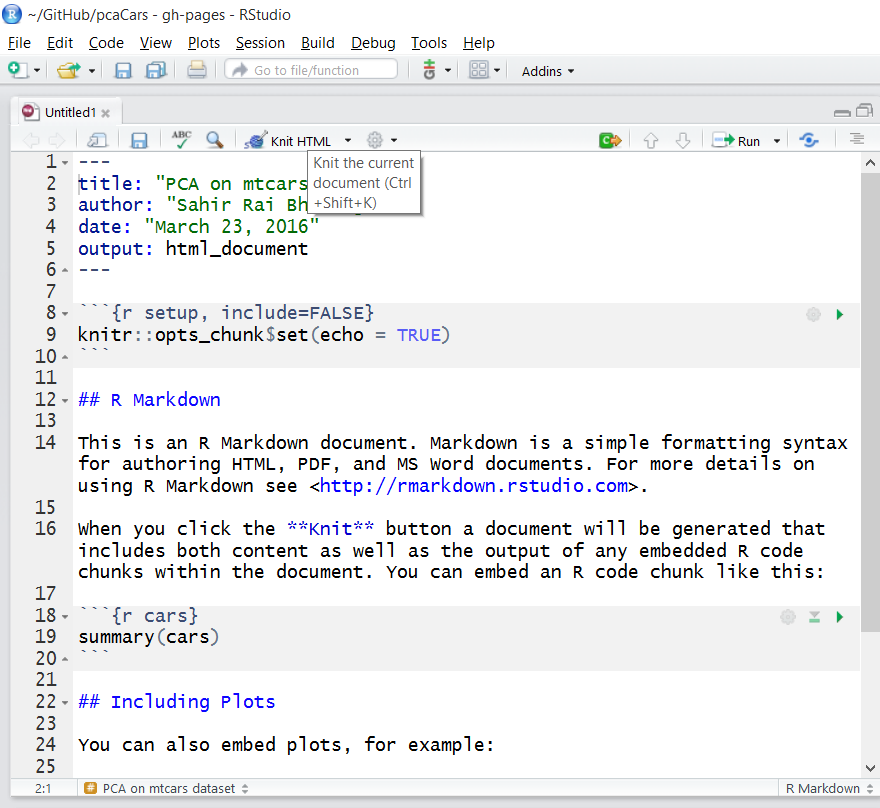

*************
*************
*************
*************
*************


## Step 6

You will be prompted to save the file. **It must be saved as `index.Rmd`**  
Click on `Save`

*************

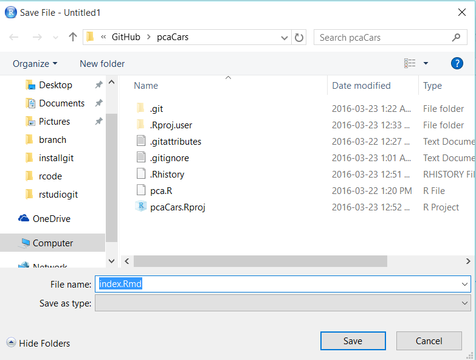

*************
*************
*************
*************
*************


## Step 7

If everything is working properly, an HTML document named `index.html` will appear. 
This is the HTML report, also called a _dynamic document_ that contains both
`R code` and text. 

*************

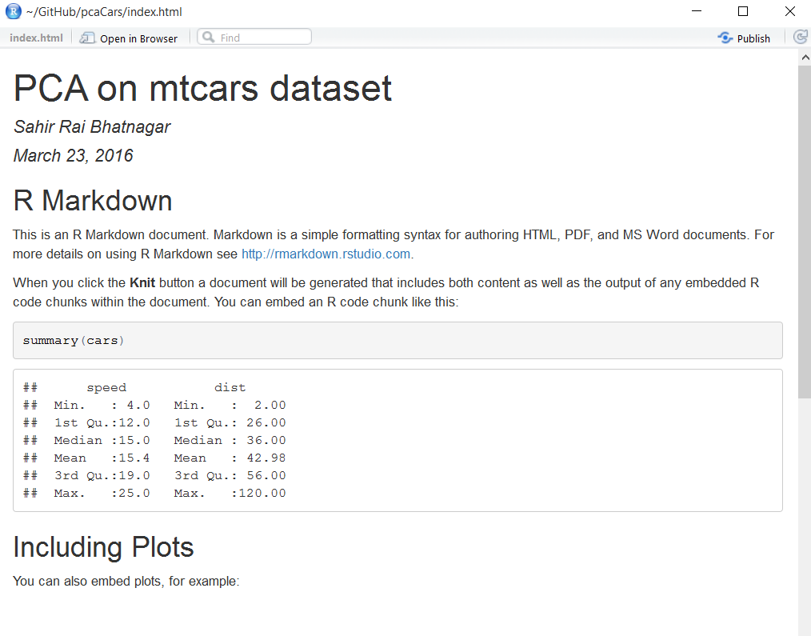

*************
*************
*************
*************
*************


## Step 8

I have created a sample report which you can see [here](https://raw.githubusercontent.com/git4ds/pcaCars/gh-pages/index.Rmd).
Copy the contents of that report and paste it into the `index.Rmd` file, replacing its entire contents. 
Click on the   button. 

*************

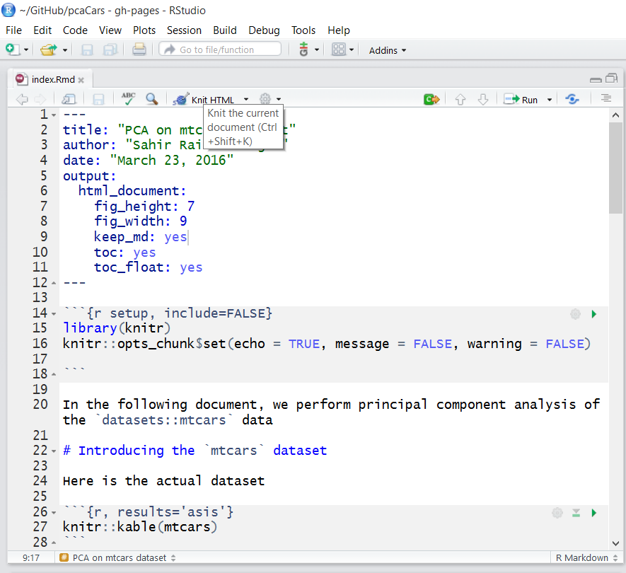

*************
*************
*************
*************
*************


## Step 9

The HTML document will automatically load after the document has finished compiling. You can view
this document in your web browser by clicking the `Open in Browser` button. 

*************

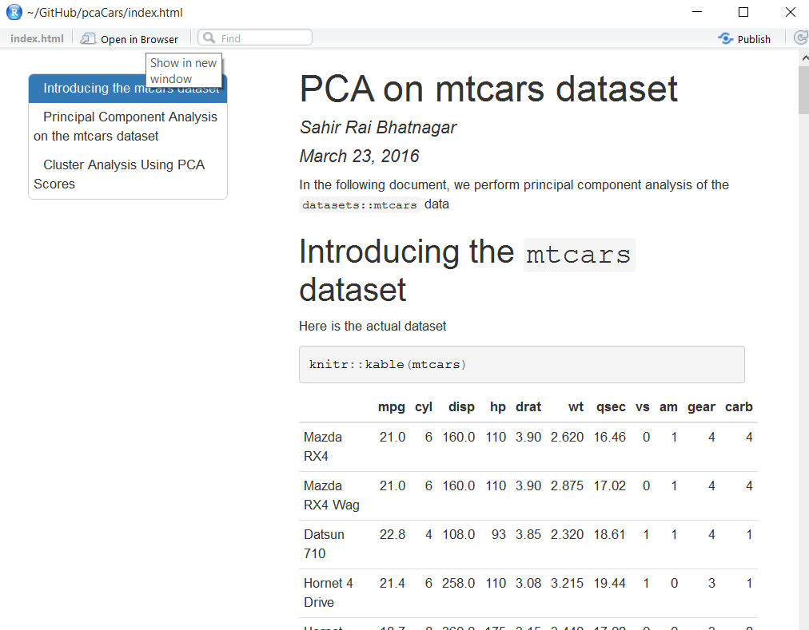

*************
*************
*************
*************
*************


## Step 10

Note the location and filename of the document. It is currently only on your computer, and
has not been published online. 

*************

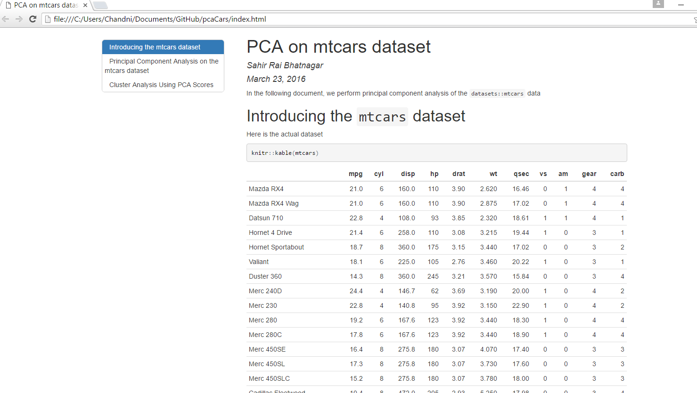

*************
*************
*************
*************
*************


## Step 11

Both RStudio and GitHub Desktop have noticed the changes you made to the `gh-pages`
branch. 

*************

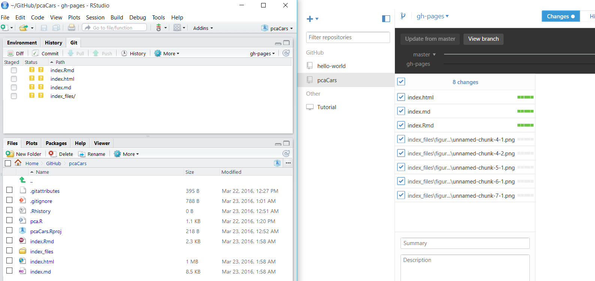

*************
*************
*************
*************
*************


## Step 12

In GitHub Desktop, select all the files that have been changed or added, describe the changes
and click on  

*************

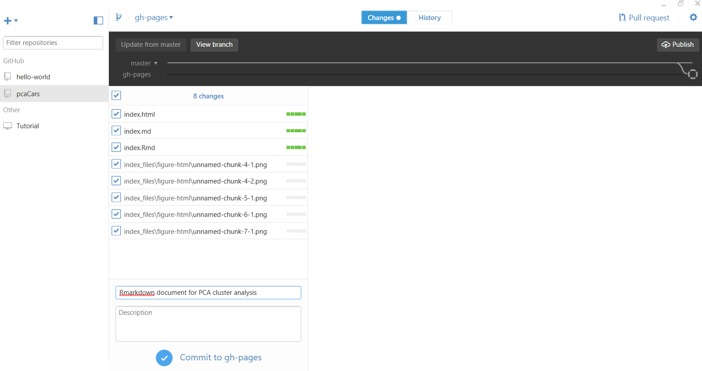

*************
*************
*************
*************
*************


## Step 13

`Publish` the local changes to your online GitHub repository by clicking the 
 button in GitHub Desktop. 

*************

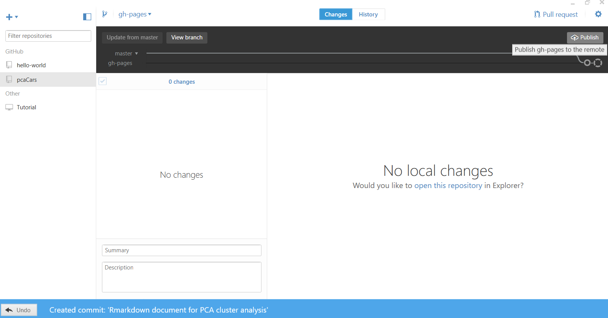

*************
*************
*************
*************
*************


## Step 14

Head over to the `pcaCars` repository in your online GitHub account. Click on the
`Branch` dropdown list and select the `gh-pages` branch. 

*************

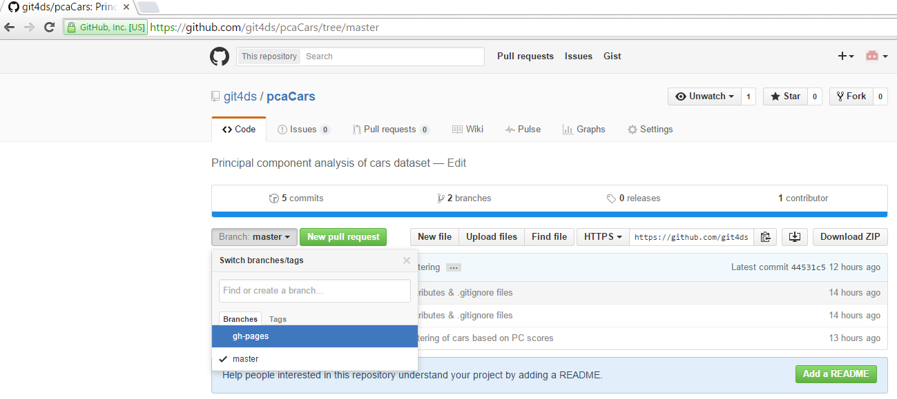

*************
*************
*************
*************
*************

## Step 15

Notice that the `R Markdown`, HTML and related files only appear in the `gh-pages`
branch because that where you _committed_ them. 

*************

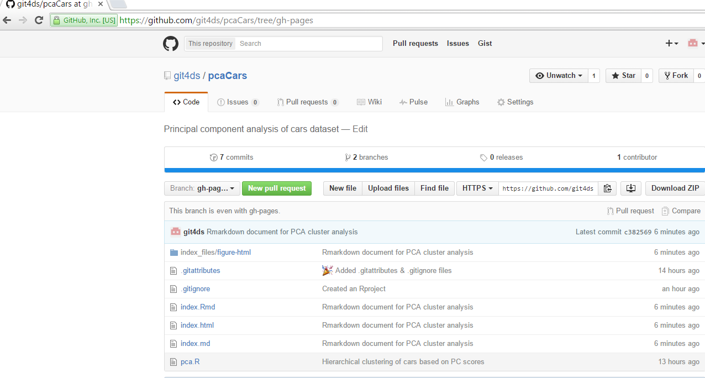

*************
*************
*************
*************
*************

## Step 16

Click on the `Settings` tab. You will see a box called `GitHub Pages` which says
that your site has been published at `http://username.github.io/pcaCars`. Click on the
site to verify that the report has indeed been published online. 

*************

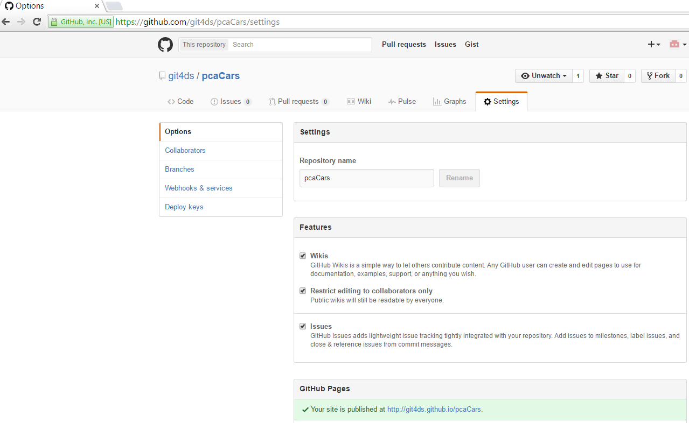

*************
*************
*************
*************
*************

## Step 17

Well done. The report has been published online. This makes it extremely easy to send 
reports to your supervisor or collaborators, without having to send large email attachments with 
long names indicating the version. Simply _commit_ new changes to the repository, and the report
will automatically get updated online. 

The website link never changes, and you can simply send
an email to your supervisor or collaborators indicating that changes have been made to the 
document. 

There are four important things to note:

1. The html document that you want to publish must be on the `gh-pages` branch. 
See [https://pages.github.com/](https://pages.github.com/) for more details.
2. The html document must be named `index.html`
3. The name of the website will always have this format: http://username.github.io/name_of_repository
4. Every repository you have can have its own website. Let's test this in Chapter 8.

*************

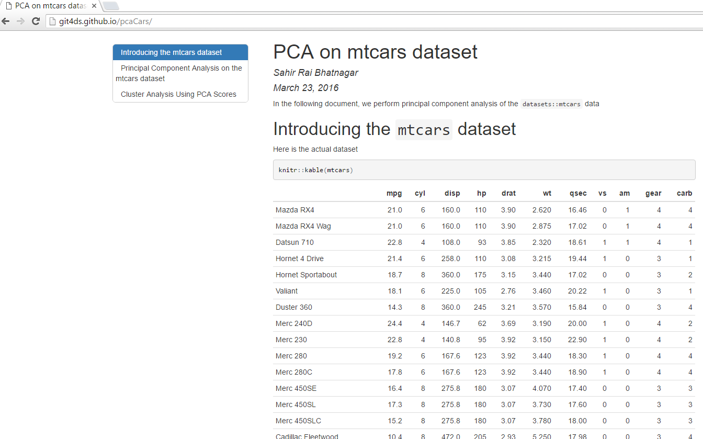

*************
*************
*************
*************
*************


# Chapter 8: Create an online CV {.tabset .tabset-fade .tabset-pills}

*************

## Introduction

In this chapter you will learn how to create an online CV. The template I have 
shown is for illustration purposes. The main objective here is for you to have a website 
that has your CV. I highly recommend the advice given by [Sherri Rose](http://drsherrirose.com/academic-cvs-for-statistical-science-faculty-positions)
on Academic CVs for Statistical Science Faculty Positions. 

*************
*************
*************
*************
*************
*************
*************
*************
*************
*************
*************
*************
*************
*************
*************
*************
*************
*************

## Step 1

In GitHub Desktop, create a new repository called `cv`. Click on 
 

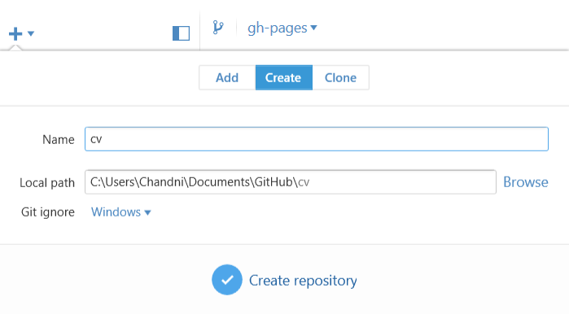

*************
*************
*************
*************
*************


## Step 2

Create a `gh-pages` branch and click on 

*************

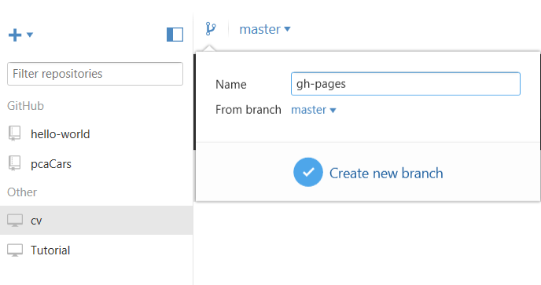

*************
*************
*************
*************
*************


## Step 3

Save [the template CV](https://raw.githubusercontent.com/git4ds/cv/gh-pages/index.Rmd) in the 
newly created `cv` repository on your computer^[[https://mszep.github.io/pandoc_resume/](https://mszep.github.io/pandoc_resume/)]. 
Open the file in RStudio and click on 
the  button. 

*************

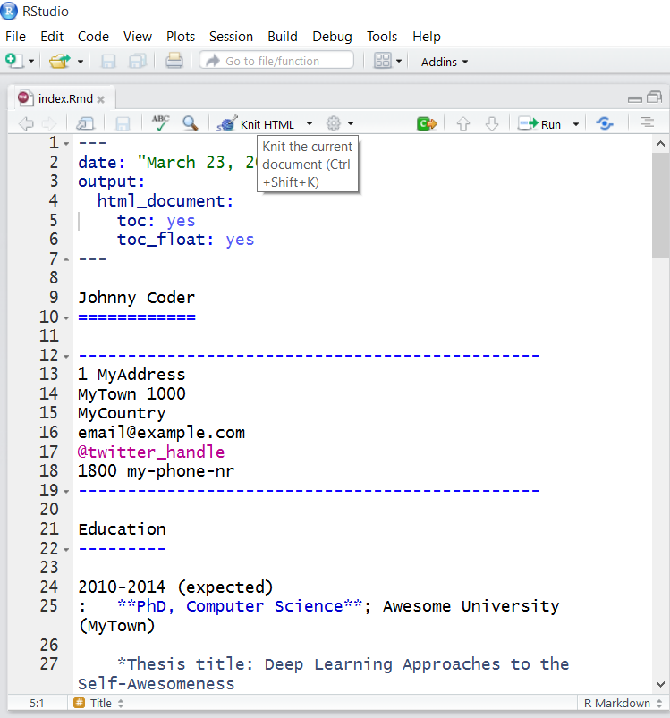

*************
*************
*************
*************
*************


## Step 4

Commit the changes in GitHub Desktop. Describe the changes you made and click on . 


*************

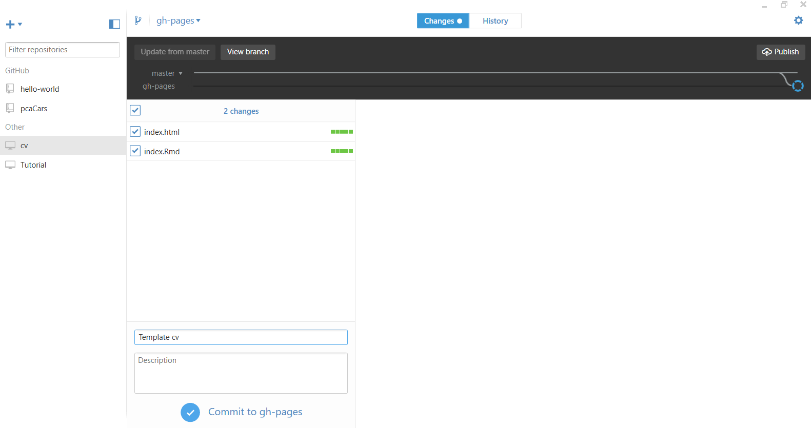

*************
*************
*************
*************
*************


## Step 5

Click on  to _push_ your changes to your online GitHub account. 

*************

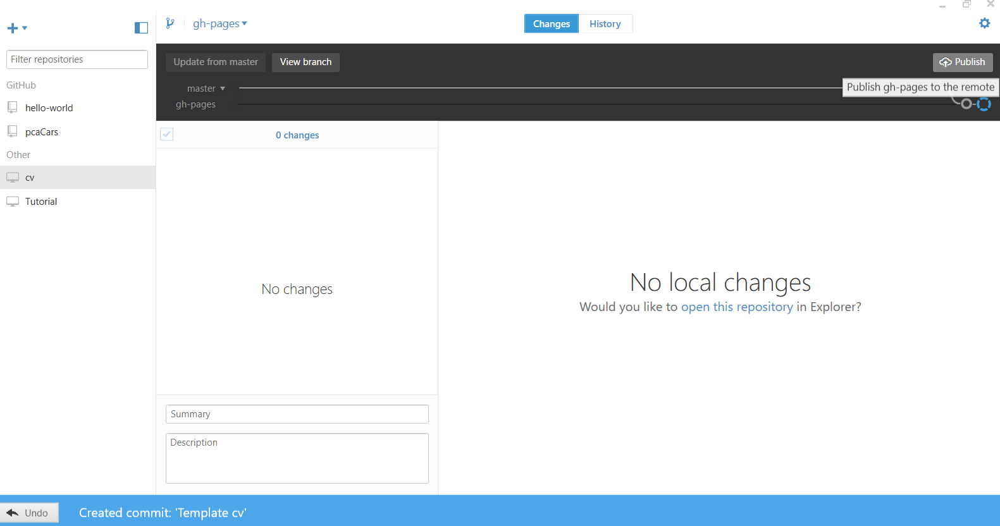

*************
*************
*************
*************
*************


## Step 6

After entering a description of the repository click on .

*************

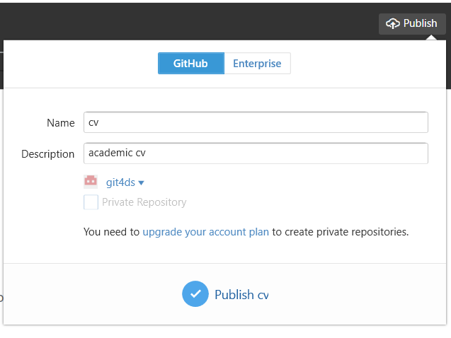

*************
*************
*************
*************
*************


## Step 7

Your GitHub Desktop should now be _clean_. 

*************

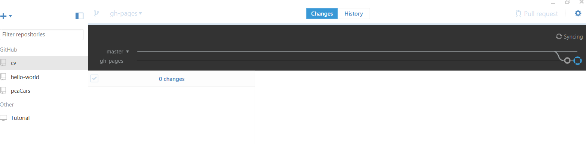

*************
*************
*************
*************
*************


## Step 8

Go to your online GitHub account and navigate to the `cv` repository

*************

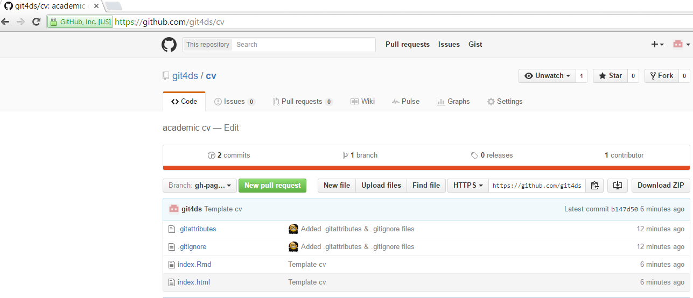

*************
*************
*************
*************
*************


## Step 9

In setting you should see that your site has been published. 

*************

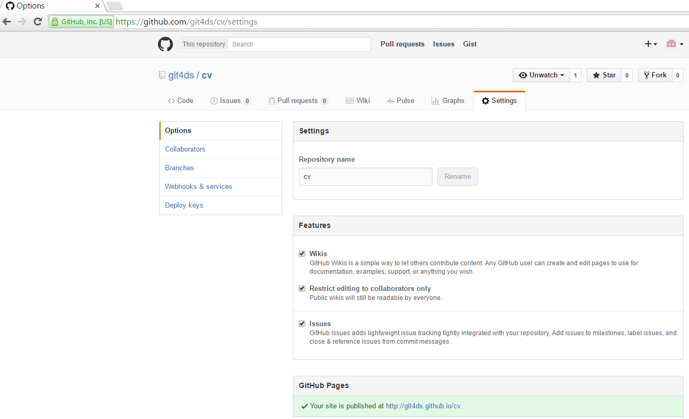

*************
*************
*************
*************
*************


## Step 10

Well done. You now have an online CV. 

*************

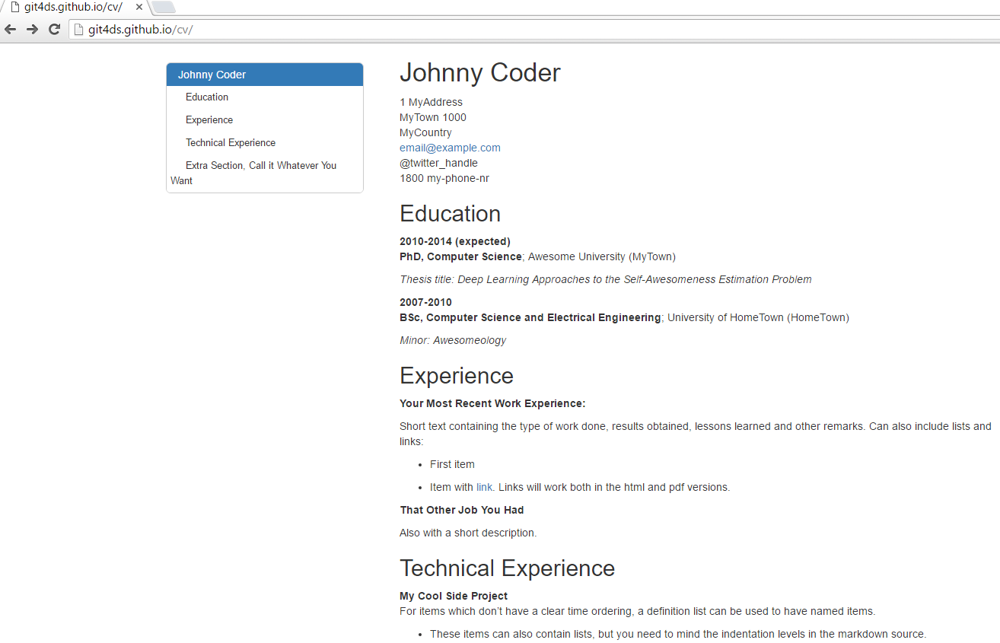

*************
*************
*************
*************
*************


